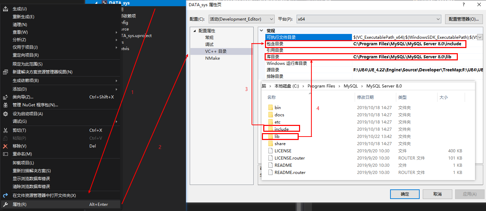

```
#include "pch.h"
#include <iostream>
#include <mysql.h>

#pragma comment(lib,"libmysql.lib")

using namespace std;

int main()
{
	MYSQL *con;
	MYSQL_RES *res;
	MYSQL_ROW row;

char dbuser[30] = "root";
char dbpasswd[30] = "root";
char dbip[30] = "127.0.0.1";
char dbname[30] = "testbase";
char tablename[30] = "surface_data";

char *query = NULL;

int rt;

con = mysql_init((MYSQL*)0);

if (con != NULL && mysql_real_connect(con, dbip, dbuser, dbpasswd, dbname, 3306, NULL, 0))
{
	if (!mysql_select_db(con, dbname))
	{
		con->reconnect = 1;
		query = const_cast<char*>("call SelectSurfaceDataByName('su_033','0000-00-00 00:00:00',null,@out_state)");
		rt = mysql_real_query(con, query, strlen(query));
		if (rt) cout << "Error:" << mysql_error(con) << endl;
		else cout << "Query Succeed:" << query << endl;

}

}
else
	MessageBoxA(NULL, "数据库连接失败", "", NULL);
res = mysql_store_result(con);
if (mysql_field_count(con) != NULL)
{
	while (row = mysql_fetch_row(res))
	{
		for (int i = 0; i < mysql_num_fields(res); i++)
			cout << row[i];
		cout << endl;
	}
}
else
	cout <<"ERROR:"<< res << endl;

mysql_free_result(res);
mysql_close(con);
return 0;

}
```

# FObjectInitializer

# 一、GENERATED_BODY()和GENERATED_UCLASS_BODY()

所有的UE4编程都会涉及到这两个宏，UE4的中文资料是少得可怜，所以只好自己一遍查资料一遍自己测试了。

## 1.GENERATED_BODY()

GENERATED_BODY()宏标识的类表示，此类不可以使用父类的声明，最常见的就是GENERATED_BODY标识的类必须要自己声明和实现无参构造函数，否则编译将无法通过。

## 2.GENERATED_UCLASS_BODY()

GENERATED_UCLASS_BODY()宏标识的类表示此类继承父类的声明，最常见的就是GENERATED_UCLASS_BODY()标识的类不需要声明构造函数，如果需要重写构造函数，则必须为构造函数传递FObjectInitializer类的常量引用，这也是为什么我们经常在UE4编程中看见如下代码的缘故

```C++
UMySQLDatabase::UMySQLDatabase(const FObjectInitializer& ObjectInitializer)
	: Super(ObjectInitializer)
{
        //重写块
}
```

其中Super()y用于给父类传递参数

<font color=red> GENERATED_BODY()和GENERATED_UCLASS_BODY()宏都会为其标识的类生成一些成员函数，只是二者在使用权限上有一些区别，具体生成了什么成员函数及其区别由于目前自己搜索到的资料过少，暂时无法弄明白，需要以后慢慢研究</font>。

# 二、配置mysql.h

在C++连接Mysql时必须要使用头文件`mysql.h`的，但是我们在`#include "mysql.h"`时经常会出现头文件无法打开的情况，这是因为VS找不到mysql相关文件的路径，我们只需按如下步骤操作即可



但是这么配置只能对当前项目有效，新建项目又需要重新配置，一劳永逸的方法目前还没有研究出来😂。

# UE4定义命名空间则无法打开.generated.h文件

# 三、使用MySQLIntegration插件进行数据库连接

- Update Data from Query Async组件后面必须再跟一个其他的节点，节点才能正常执行
- UE4 C++编程中不能出现私有私有变量？
- UE4 C++静态变量？
- MySQLIntegration插件只支持sql语句，不支持存储过程
- 在蓝图中实现的C++函数在蓝图中没法使用？
- 暴露给蓝图的变量和函数必须是公有且非静态的
- UE4 C++类创建对象，大象无形31页
- UE4 C++编程中if else语句必须加{}