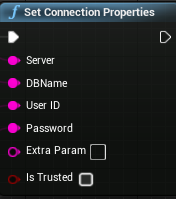
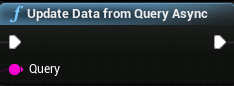
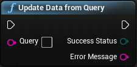
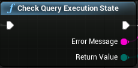
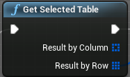
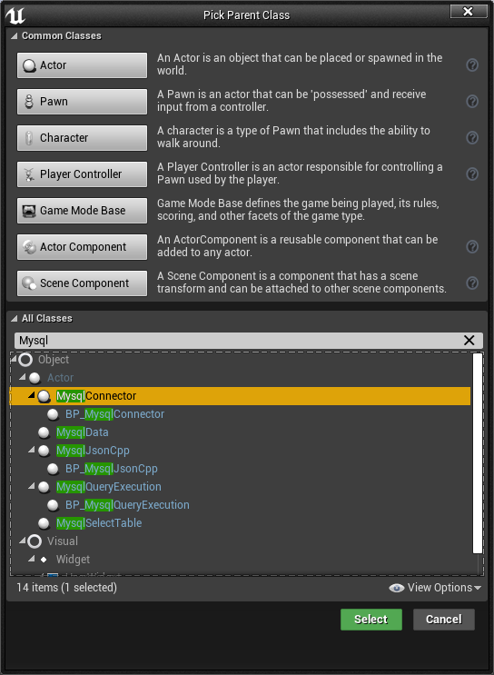
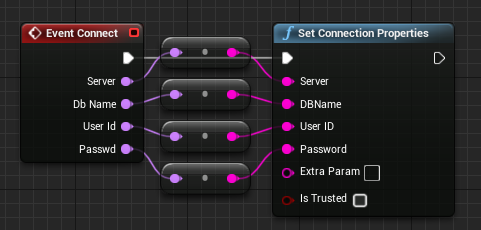

# 一、使用MySQLIntegration插件连接Mysql

- Update Data from Query Async组件后面必须再跟一个其他的节点，节点才能正常执行
- UE4 C++编程中不能出现私有私有变量？
- UE4 C++静态变量？
- MySQL Integration插件只支持sql语句，不支持存储过程
- 在蓝图中实现的C++函数在蓝图中没法使用？
- 暴露给蓝图的变量和函数必须是公有且非静态的
- UE4 C++类创建对象，大象无形31页
- UE4 C++编程中if else语句必须加{}

## 1.MySQL Integration安装

MySQL Integration插件可以直接在UE4商城中搜索到，直接下载安装即可，如何是从外部导入的离线包，直接将插件文件夹丢入UE4安装目录下的Engine\Plugins文件夹下即可。

## 2.激活MySQL Integration

激活插件直接在UE4中的Edit/Plugins/Installed下找到MySQL Integration勾选Enabled即可，勾选插件之后UE4会提示需要重启UE4才可激活，重启软件就可以激活插件了。

## 3.MySQL Integration提供的蓝图组件

官方文档： https://sameek4.github.io/KodeSpire/Pages/MySQLIntegration.html 

### Set Connection Properties(Mysql连接)

Set Connection Properties组件提供UE4对Mysql的连接服务。



**输入：**

- server：数据库的连接ip；
- DBName：数据库的名字；
- User ID：登录数据库用户名；
- Password：登录数据库的用户密码；
- Extra Param：SetConnectionProperties提供的额外参数传入；
- Is Trusted：启用windows用户名和密码登录数据库。

### Check  Connection State(Mysql连接状态检查)

此组件提供对Mysql连接的状态的查询服务。


**输出：**

- Error Message：输出错误信息；

- Return Value：输出连接状态；

  包含如下状态值(类型为插件定义的EMysqlConnectionStateEnum枚举)：

  - Broken：数据库损坏；
  - Closed：连接关闭；
  - connecting：正在连接；
  - Eecuting：正在发送命令；
  - Fetching：数据库正在检索数据；
  - Open：连接以正常打开，可以正常使用数据库。

### Update Data from Query Async(异步发送非查询sql命令)



此组件提供非查询的sql命令发送服务，即发送insert，delete，create等命令。

### Update Data from Query (同步发送非查询sql命令)



**输入：**

- Query：sql命令字符串；

**输出：**

- Success Status：命令的执行状态

  有三种执行状态值，类型为插件自定义的EMysqlSuccessStateEnum枚举，

  - Executing：sql命令正在发送；
  - Success：sql命令执行成功；
  - Failed：sql命令执行失败。

- Error Message：输出错误信息。

### Check Query EXecution State(检查上一条命令的执行状态)

此组件提任何sql命令的执行状态检查，<font color=red>但仅限检查Check Query EXecution State执行前的上一条sql语句的状态检查。</font>



输出内容和Update Data from Query一致。

### Select Data from Query Async(异步发送查询命令)

此组件仅限发送select语句，其他语句发送无效，<font color=red> 查询到的数据会存储到插件自带的数据结构中，可以使用下面介绍的Get Selected Table组件进行数据访问。</font>


## Get Selected Table(读取数据表)



**输出:**

- Result by Column：以列的形式返回数据，<font color=red>返回一个MySQLDataTableStructures的结构体数据，每一个结构体就是一列，MySQLDataTableStructures结构体包含两个成员ColumnName(列名)和ColumnData(列数据)，其中ColumnData是一个FString类型的TArray数组，数组中每一个元数就是该列中某一行的数据。</font>
- Result by Row：以行的形式返回数据，返回一个<font color=red> 返回一个MySQLDataRowStructures类型的结构体数组，每一个结构体就是一行，MySQLDataRowStructures结构体包含一个FString类型的TArray数组，数组中每一个元素就是该行中某一列的数据。</font>

## 4.MySQL Integration的注意事项

### MySQL Integration不支持存储过程

MySQL Integration插件不支持数据库的存储过程的语法，在Query引脚输入“Call ProdureceName(ParameterList) ”是没有办法唤醒数据库中的存储过程的，所以很多的数据库中的查询和插入逻辑就需要在外部实现了。

### MySQL Integration不提供C++函数

MySQL Integration插件只提供蓝图组件不提供C++函数，也就是说数据库的连接查询等只能使用蓝图来实现，但大多数情况我们又必须在C++中访问数据库，在这钟情况下我们该如何做呢？

目前，我只想到一种方法，就是在C++中创建访问数据库的类在类中声明数据库的访问函数，用这个类的蓝图子类来重写该数据库访问函数，以实现父类中该数据库访问函数，这是由C++继承中的重写的特性实现的。

具体做法如下：

首先在C++中创建一个专门负责连接数据库的类并在类中声明连接函数。

```C++
#include "MysqlJsonCpp.h"
#include "CoreMinimal.h"
#include "GameFramework/Actor.h"
#include "MysqlConnector.generated.h"

UCLASS()
class DATA_SYS_API AMysqlConnector : public AActor
{
	GENERATED_BODY()
public:	

	UPROPERTY(BlueprintReadWrite,Category = "VariableRW")
	FString errorMessage;
	UPROPERTY(BlueprintReadWrite, Category = "VariableRW")
	FString stateMessage;

protected:

	virtual void BeginPlay() override;

public:	

	AMysqlConnector();
	virtual void Tick(float DeltaTime) override;

	//从配置文件ConnectConfig.json中读取Mysql连接配置文件
	void ConnectMysqlByConfig();
    
	//使用MySQLIntegration插件连接Mysql
	UFUNCTION(BlueprintImplementableEvent,Category = "OverridFunction")
	void Connect(FName server, FName dbName, FName userId, FName passwd);
    
	//使用MySQLIntegration插件检查连接状态
	UFUNCTION(BlueprintImplementableEvent, Category = "OverridFunction")
	bool ConnectState(FString &errorMessageParam,FString &stateMessageParam);
	//获取连接状态
	bool GetConnectState();
};
```

上面的void Connect(FName server, FName dbName, FName userId, FName passwd);函数就是需要用蓝图实现的数据库连接函数，<font color =red> 这里要注意，这个函数只能在C++中声明，不可以实现，否则父类调用此函数时将无法关联到子类的重写，并且这个函数需要使用`BlueprintImplementableEvent`参数暴露给蓝图</font>。

<font color =red> 这里还需要注意，如果这个函数中使用了变量的引用，那么这个变量也需要使用`UPROPERTY(BlueprintReadWrite, Category = "VariableRW")`暴漏给蓝图，如上面的`FString errorMessage;`一样。</font>

这样我们就可以创建一个蓝图类来继承这个类，



然后在该蓝图类的MyBlueprint/Functions/Override下看到我们在C++类中声明的函数，直接重写实现即可，如：



实现时候我们就可以在C++中调用这个函数了，这个函数就会通过重写关联到蓝图自类中的重写过程，如此数据库便连接上了。

# 二、使用C++库连接Mysql

目前卡在#include<mysql.h>编译不通过。