此学习记录在Unity3d的基础之上学习

# 一、UE4的文件结构

## 1.安装目录结构

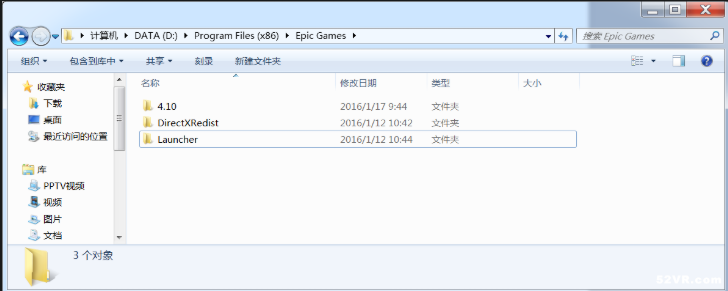

**DirectXRedist**

 DirectXRedist是DirectX文件所在的地方。这个文件夹也包括了安装DirectX的安装包。

**Launcher**

Launcher是引擎启动器所在文件夹。Launcher包含了如下子文件夹：

- Backup：这里是保存备份的工作。如果中途发生崩溃，或者出现了难以解决的错误，可以从这里恢复工作进度。
- Engine：这个文件夹包括了组成引擎的代码、库和内容。
- PatchStaging：这里保存了下载UE4版本的临时数据。
- VaultCache：这个文件夹包含了所有你从商城购买的资源的缓存。

**4.10**

4.10文件夹有如下子文件夹：

- Engine：它包含了所有源代码、库、资源、map文件之类的组成引擎的部分。
- Samples：UE4提供了两个示例Maps，这个文件夹包含了资源，蓝图等。
- Templates：UE4提供了不同类型游戏的模版，这个文件夹包含了不同类型游戏的内容和源代码

不同UE4版本目录结构可能有所不同，但大体上不会有太大差别、

## 2.项目目录结构

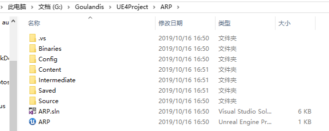

**.vs**

VS的智能解读和智能提示的缓存

**Binaries**

编辑器热加载类的二进制文件

**Config**

Config是配置文件，保存一些偏好设置等配置

**Content**

Content文件与引擎里的Content文件对应

Content文件的目录结构

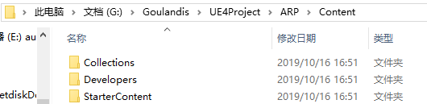

其中**Collections**和**Developers**主要存放我们在使用引擎的时候生成的一些链接文件和临时文件。

在引擎中可以在View Options中选择是否在引擎理显示这两个文件夹，默认情况下，这两个文件夹是不显示的。

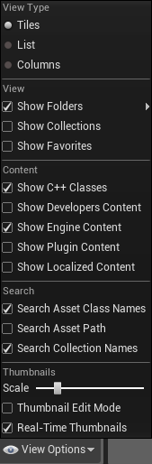

**StartContent**文件就是我们创建工程时导入新手包

**Intermediate**

Intermediate文件夹存放我们在引擎中构建的一些中间文件，如：光照的构建文件等等。

**Saved**

Saved中保存项目的备份文件和开发日志

**Source**

Source对应引擎中C++Class文件夹

**ARP.sln**

VS解决方案的文件

**ARP**

项目的启动文件

# 二、UE4的工作界面

## 1.开始目录

UE4支持两种工作模式，即蓝图模式和C++编程模式

**蓝图模式**

蓝图模式提供可视化编程，可以做到不写一句代码就可以实现一个完整的游戏，但是蓝图模式对于实现一些复杂的逻辑较为困难。

**C++编程模式**

C++编程模式是较为传统的游戏实现模式，主要以编写代码的方式来实现游戏模块，功能强大，使用灵活。

## 2.菜单栏


**File**

创建、打开、保存关卡/地图和创建或打开项目。游戏打包也是在这里。这里也有不同的设置和建立配置可以修改，后面会详细说明。

**Edit**

撤销、恢复、剪切、复制、粘贴或者重复任何选中的对象（或一组选中的对象）。也可以设置偏好，例如自动保存开关和自动保存的时间、改变快捷键、改变测量单位（厘米、米或千米）。项目设置则提供了描述项目的内容设置、项目ID或项目该如何打包，还有该项目支持什么样的平台。更多的设置读者可以自行探索，直到调整到适合自己工作的方式。

**Window**

编辑器中的窗口布局是完全可以自定义的，这里可以选择增加或删除哪些窗口。你也可以通过鼠标点击窗口标签，然后拖动，再释放鼠标来手动调整窗口位置。注意，有时候窗口的标签默认是隐藏的，这时候点击左上角的黄色箭头，然后标签就会显示出来了。当你打乱了当前的窗口布局，又不知道如何恢复的时候，可以选择窗口菜单中的重置布局。

**Help**

官方教程、文档、论坛、回答中心等常用的超链接都会显示在这里。 

## 3.工具栏


**Save Current**

保存当前的工作进度(当前关卡)，可以防止崩溃造成工作进度大量丢失。

我们一般使用Save All而不使用Save Current


**Source Control**

默认是关闭的，版本管理是协作开发方式，并且它会记录每一次的更改，当你修改了文件，团队中的其他人就会更新修改的文件，并且如果他们修改了文件，你也会被更新文件。通过点击版本控制按钮，选择自己团队的版本控制工具来激活版本管理。

**Content**

包含了所有资源、代码、关卡和其它游戏开发用到的内容。

Content对应Content Browser窗口

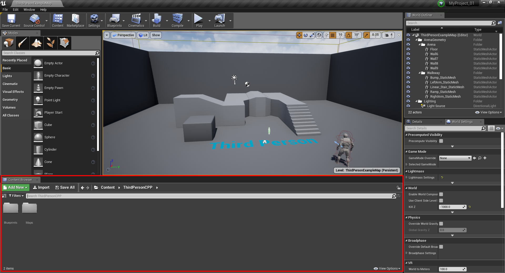

Marketplace

一个访问商城的快捷方式。

**Setting**

修改编辑器的设置。例如允许选择半透膜物体、选择组合物体等。引擎的可视化设置，例如分辨率、贴图渲染质量、抗齿锯等都可以在此处设置。

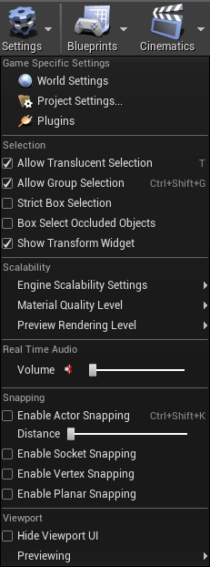 

**Blueprints**

蓝图是一个UE4的很重要和很常用的特性。这里可以进入蓝图编辑器。

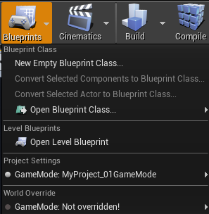

**Cinematices**

你可以使用过场动画来创建电影艺术。

**Build**

当你构建你的关卡，引擎可以预计算灯光和可视化数据、产生导航网络和更新几何体。

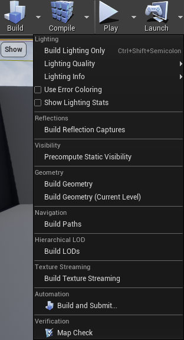

**Play**

当你点击播放按钮，在视图中会测试你的关卡和观察是否功能正常。当你点击播放后，会出现暂停、停止、弹出按钮 

- 暂停：当暂停后，你可以点击继续或逐帧播放。
- 停止：停止游戏测试，回到编辑模式。

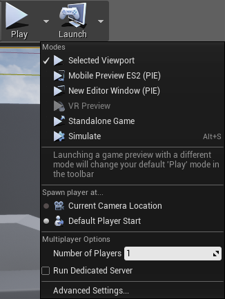

**Launch**

当你的游戏已经完成并且准备发布，点击启动按钮会制作、打包和生成可执行的应用程序文件（这依赖于选择的平台）。

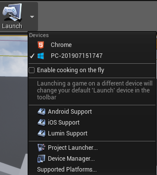

## 4.视口

 视口位于编辑器窗口中央，这里可以创建和调试你的游戏。将游戏对象都可以放置在这里来创建当前的场景。 

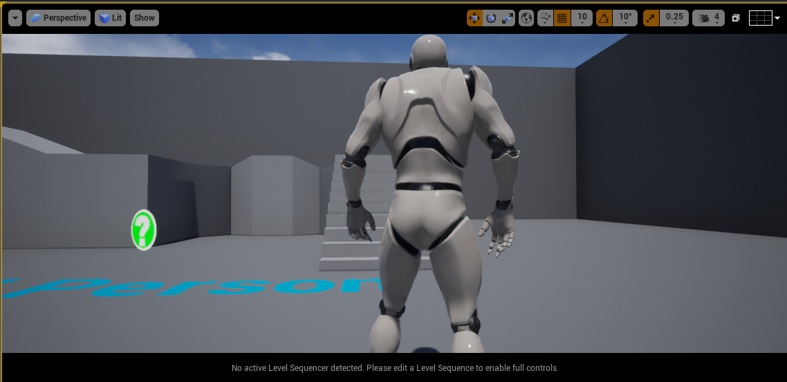

**观察**

按下鼠标左键或右键的同时，你可以使用W、S、A、D来移动到观察的视角。

**选择**

鼠标点击左键。

 在视图上方的是视图工具栏，我们来逐一说明它们：

**视口选项**

这里可以切换到游戏模式，可以将场景像在游戏中那样展示出来，所以那些音量、隐藏的actors和actor图标都会被隐藏起来。还有沉浸模式，将会以全屏模式显示。还有其他设置选项可以被设置，所以最好自己亲自试试。

快捷键：G


**视口投影类型**

这里有两种视口投影类型，一种是正交投影、一种是透视投影。透视投影符合人的视觉，所以看起来更像3D场景，而正交投影像是将某个轴去掉后的2D平面。


**视口渲染模式**

设置显示的渲染模式，默认的是带光照模式，将游戏中的灯光显示在视口中。你可以切换到不带灯光模式，就会没有任何灯光了。线框模式，只会显示模型的线框。 


 **显示**

设置哪些类型的actor可以显示出来，哪些类型被隐藏。


**变换工具**

这里有三种变换方式。第一个是平移，第二个是旋转，第三个是缩放。


使用方法和Unity一致

 **坐标系统**

切换全局坐标系和局部坐标系。如果选中的是全局坐标系，则变换会以世界坐标系的轴为准。如果选中的是局部坐标系，则变换会以物体自身旋转的方向的轴为准。


**表面对齐、表面网格对齐、表面网格对齐值**

接着的这三个工具涉及到平移的对齐操作。表面对齐的时候，只要两个actor的轴心在底部，当它们靠近的时候就会自动对齐了。网格对齐，是每次移动的时候都会移动网格对齐值大小的值。


**旋转网格对齐、旋转网格对齐值**

类似于表面网格对齐，旋转网格对齐每次旋转都是旋转某个固定的旋转网格对齐值。


**缩放网格对齐、缩放网格对齐值**

类是于上面两个对齐，每次缩放的时候都是按某个固定的缩放网格对齐值来缩放。


**摄像机速度**

设置当按下箭头键的时候摄像机移动的速度。

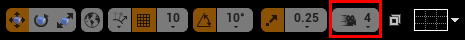

**最大化和恢复视口**

当你点击右上角的这个按钮的时候，最会在透视视图和三视图+透视视图之间切换（见下图），三视图就是正视图、俯视图和左视图。每个视图都有自己的视图工具栏，你在某个视图中右上角点击一下，然后该视图就会被最大化。

 

**网格**

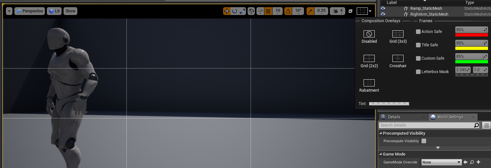

## 5.世界大纲

世界大纲视图有层次地展示了在场景中的所有actor。

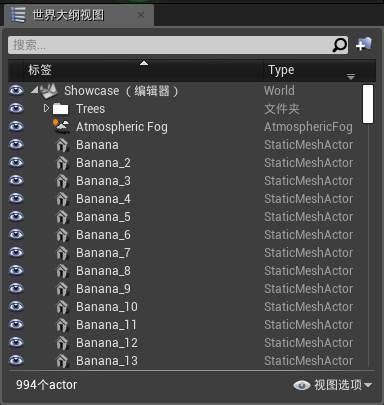

在世界大纲视图你可以进行这些操作：
**新建文件夹**：你可以通过文件夹管理使得actor整洁有序，也可以通过文件夹来选中一组actor（右键文件夹，选择-所有子项）。

**隐藏actor**：在actor和文件夹前面有一只眼睛，通过点击它来隐藏/显示该actor或文件夹下的所有actor。
**附加actor**：通过拖动一个actor到另一个actor，可以形成附加关系。如果你移动父关系的actor，所有的子actor都会跟着移动。如果移动子actor，父actor就不会跟着移动。需要注意的是，这只能通过世界大纲视图完成，在视口中移动父actor是不会影响子actor的。 

左下角显示的是有多少个actor，右下角显示的是设置视图过滤方式的选项。

## 6.内容浏览器

所有游戏资源，包括材质、贴图、网格、蓝图、音频文件都会在这里显示出来。这里是导入、组织、观察甚至创建游戏资源的地方。 

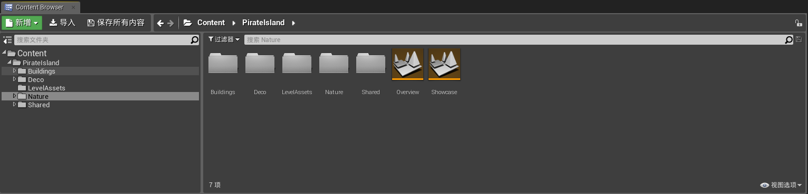

在顶部有三个图标，下面逐一介绍它们：

- 添加新项：创建新的资源，例如材质、粒子系统、蓝图等等。
- 导入：导入内容到项目文件中。
- 保存所有：如果在内容浏览器创建或修改资源，点击保存所有来保存这些工作。


然后接着下面有个搜索条，可以输入要搜索的资源名字来快速查找它们。右上角的锁图标可以锁住所有“在内容浏览器查找”的请求。所谓“在内容浏览器查找”就是在视口中右键actor的时候，弹出菜单中选择“在内容浏览器查找”就会将查找到的对应资源显示在内容浏览器中。如果锁住了，则不会在内容浏览器中显示出来，而是打开一个新的窗口显示。

在下方左侧有个源面板，源面板包含了你的项目中收集的所有文件夹。在下方右侧，是资源视图，显示了从源面板中选择的资源和子文件夹。在上方有个过滤器，可以指定你想要查看的资源类型。右方就是资源搜索栏。在底部左方你可以看见当前选择的文件夹有多少个资源，底部右方可以选择视图选项，选择你观察项目的方式，例如是平铺块、列表还是列显示方式 

## 7.细节

 在细节面板，你可以看见和修改当前选择的actor属性。 

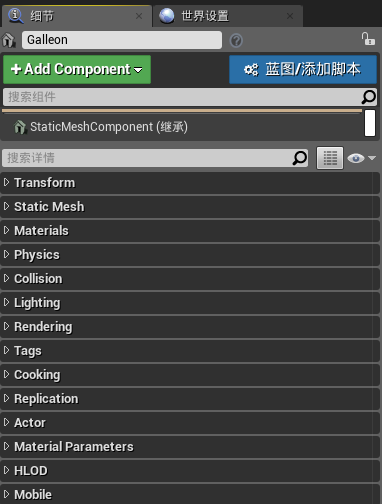

在顶部，你可以看到选择的actor的名称（图中是Chair）。你可以设置自己喜欢的命名。在右方，就是一个锁按钮。默认是解锁状态，当锁住的时候，细节面板会锁定当前的属性和细节，如果你选择另一个actor也不会改变。 

下方的搜索栏可以搜索你想查看的属性，接着是属性矩阵按钮，这会打开一个属性矩阵窗口。再右方是显示过滤器，你可以选择折叠/展开所有的种类、只显示修改的属性或显示高级属性。 

在名字的下方，有两个按钮，添加组件和蓝图/添加脚本。添加组件，可以添加例如静态网格、形状基本几何体（正方体、球体、圆柱和圆锥体），灯光actor等。这跟世界大纲视图中的附加Actor类似。接着，你可以转换选择的actor到蓝图类。蓝图类是作为一个组件，伴随着代码（Unity等一些其它引擎中，称为Prefab预制件）。

 最后，下方是属性区域，这里显示选择的actor属性,例如位置、旋转、缩放、当前的材质、添加和移走材质等等你可以修改的内容。 

# 三、UE4的快捷键

| 按键                   | 动作                             |
| :--------------------- | :------------------------------- |
| 鼠标左键               | 选择actor                        |
| 鼠标左键+拖动          | 前后移动和左右旋转摄像头         |
| 鼠标右键               | 选择actor并打开右键菜单          |
| 鼠标右键+拖动          | 旋转摄像头方向                   |
| 鼠标左键+鼠标右键+拖动 | 摄像头上下左右移动               |
| 鼠标中键+拖动          | 摄像头上下左右移动               |
| 滑轮向上               | 摄像机向前移动                   |
| 滑轮向下               | 摄像机向后移动                   |
| F                      | 聚焦选中的actor                  |
| 箭头方向键             | 摄像机前后左右移动               |
| W                      | 选中平移工具                     |
| E                      | 选中旋转工具                     |
| R                      | 选中缩放工具                     |
| W+任何鼠标按键         | 摄像机向前移动                   |
| S+任何鼠标按键         | 摄像机向后移动                   |
| A+任何鼠标按键         | 摄像机向左移动                   |
| D+任何鼠标按键         | 摄像机向右移动                   |
| E+任何鼠标按键         | 摄相机向上移动                   |
| Q+任何鼠标按键         | 摄像机向下移动                   |
| Z+任何鼠标按键         | 增加视野（鼠标释放后会恢复原状） |
| C+任何鼠标按键         | 缩小视野（鼠标释放后会恢复原状） |
| Ctrl+S                 | 保存场景                         |
| Ctrl+N                 | 创建新场景                       |
| Ctrl+O                 | 打开一个已有的场景               |
| Ctrl+Alt+S             | 另存为新场景                     |
| Alt+鼠标左键+拖动      | 复制当前选中的actor              |
| Alt+鼠标右键+拖动      | 摄像机前后移动                   |
| Alt+P                  | 进入Play预览模式                 |
| Esc                    | 退出预览模式                     |
| F11                    | 进入仿真模式                     |

# 四、类

## 1.UE4中的预定义类

### UObject类

Uobject类提供以下功能：

- Garbage collection垃圾收集
- Reference updating引用自动更新
- Reflection反射
- Serialization序列化
- Automatic updating of default property changes自动检测默认变量的更改
- Automatic property initialization自动变量初始化
- Automatic editor integration和虚幻引擎编辑器的自动交互
- Type information available at runtime:运行时类型识别
- Network replication网络复制

我将会详细讲述这些功能中重点功能的含义。

**垃圾收集**

C++的内存管理是由程序员完成的。因此对象管理一直是一个很棘手的问题。往往一个对象可能会引用多个其他对象，同一个对象也可能会被多个对象引用。那么，当你不需要用到当前对象A的时候，该不该释放该对象所在的内存区域？任何人都会犹豫释放一旦有别的对象引用当前对象，释放后就会产生野指针。当另一个对象来访问时，会看到空空如也甚至是其他对象的内存区域。不释放有可能我已经是最后一个引用这个对象的人了，一旦我丢弃这个指针，这个对象就不会再有人知道，这片内存区域永远无法被回收。对此虚幻引擎提供了如下两个解决方案

- 继承自 UObject类，同时指向 UObject类实例对象的指针成员变量，使用UPROPERTY宏进行标记。虚幻引擎的 UObject架构会自动地被 PRoperty标记的变量考虑到垃圾回收系统中，自动地进行对象的生命周期管理。

- 采用智能指针。请注意，只有非 UObject类型，才能够使用智能指针进行自动内存释放。

**反射**

反射并不是图形学意义上的“反射”。而是指一种语言的机制。这样的机制在C#、Java中已经存在，但是C++并没有。我以一种通俗易懂的解释来描述反射，如果你需要反射的详细解释，请阅读搜索引擎中对反射的解释如果你是一名C++程序员，那么请你思考一个问题我该如何在运行时获取一个类？有哪些成员变量、成员函数？我该如何获取这些成员变量的名字？很难对吗？C++本身没有提供这样一套机制。尽管你可以用各种方式来手动实现虚幻引擎实现了这样一套机制。

**序列化**

当你希望把一个类的对象保存到磁盘，同时在下次运行时完好无损地加载，那么你同样需要继承自 UObject类但是需要澄清的是，你可以通过给自己的纯C++类手动实现序列化所需要的函数来让这个类支持序列化功能。这并不是 UObject类独有的。

**与虚幻引擎编辑器的交互**

还记得虚幻引擎编辑器的 Editor面板吗？你希望你的类的变量能够被 Editor简单地编辑吗？那么你需要继承自这个类。

**运行时类型识别**

请注意，虚幻引擎打开了GR-编译器参数。意味着你无法使用C++标准的RTT1机制: dynamic-cast。如果你希望使用，请继承自 UObject类，然后使用cast<>函数来完成。这是因为虚幻引擎实现了一套自己的、更高效的运行时类型识别的方案。

**网络复制**

当你在进行网络游戏开发（c/s架构）时，你一定希望能够自动地处理变量的同步。而继承自 UObject类，其被宏标记的变量能够自动地完成网络复制的功能。从服务器端复制对应的变量到客户端。

综上所述，当你需要这些功能的时候，你的这个类应该继承自 UObject类，请注意: UObject类会在引擎加载阶段，创建一个 Default Object默认对象。这意味

- 构造函数并不是在游戏运行的时候调用，同时即便你只有一个 UObject对象存在于场景中，构造函数依然会被调用两次。

- 构造函数被调用的时候， WOrld不一定存在。 Get World0返回值有可能为空！

### Actor类

Actor类具有组件挂载能力，即所有需要挂载组件的对象都需要继承Actor类，但是有一点是需要纠正的，Actor类不是必须的，说“Actor类是一切实体的基类”这种说法严格意义上来说是不正确的，比如：做一个管理类对象就不需要挂在其他的组件。

还需要注意的一点是，UE4中的component和Unity中的component是极大的区别的，在UE4中一个场景实体对应一个类，而Unity中一个场景实体可以挂载多个脚本组件，一个脚本组件就是一个类。

使用UE4创建一个Actor类编译器中为如下结构

```C++
#include "CoreMinimal.h"
#include "GameFramework/Actor.h"
#include "Act.generated.h"

UCLASS()
class ARP_05_API AAct : public AActor
{
	GENERATED_BODY()
	
public:	
	// Sets default values for this actor's properties
	AAct();

protected:
	// Called when the game starts or when spawned
	virtual void BeginPlay() override;

public:	
	// Called every frame
	virtual void Tick(float DeltaTime) override;

};
```

BeginPlay()是一个在游戏开始时和对象生成时就会调用的一次的函数；

Tick(float DeltaTime)函数则是每帧调用，DeltaTime是上一帧到这一帧所经历的时长，有UE4系统传入。

### Pawn类

 Pawn类是一个代表你或者代表电脑的人工智能的游戏对象，它是可以在屏幕上控制的游戏对象。Pawn类是从Actor类中基础的，它可以通过玩家的设备（键盘、鼠标等）控制或者被人工智能脚本控制。如果它是被玩家控制的，我们通常称之为controller（控制器）；如果它是被人工智能脚本控制的，我们通常称之为AI（Artificial Intelligence，人工智能），如果你经常玩游戏，那些NPC（Non-player Characters，非玩家角色）就通常具有AI行为。 

### Character类

Character类代表一个角色，它继承自Pawn类。那么，什么时候该继承自 Character类，什么时候该继承自Pawn类呢？这个问题的答案，我们必须从 Character类的定义中寻找—它提供了什么样的功能？Character类提供了一个特殊的组件， Character Movement。这个组件提供了一个基础的、基于胶囊体的角色移动功能。包括移动和跳跃，以及如果你需要，还能扩展出更多，例如蹲伏和爬行。如果你的Pawn类十分简单，或者不需要这样的移动逻辑（比如外星人飞船），那么你可以不继承自这个类。当然，现在很多游戏中的角色（无论是人类，还是某些两足行走的怪物），都能够适用Character类的逻辑。

### Controller类

Controller是漂浮在 Pawn/Character之上的灵魂。它操纵着Pawn和 Character的行为。 Controller可以是AI， AI Controller类，你可以在这个类中使用虚幻引擎优秀的行为树/EQS环境查询系统。同样也可以是玩家， Player Controller类。你可以在这个类中绑定输入，然后转化为对Pawn的指令。为何虚幻引擎采用这样的设计。Epic给出的理由非常简单:“不同的怪物也许会共享同样的 Controller，从而获得类似的行为”。其实， Controller抽象掉了“怪物行为”，也就是扮演了有神论者眼中“灵魂”的角色。既然是灵魂，那么肉体就不唯一，因此灵魂可以通过 Possess/Un Possess来控制一个肉体，或者从一个肉体上离开。

### 各个类之间的层级关系

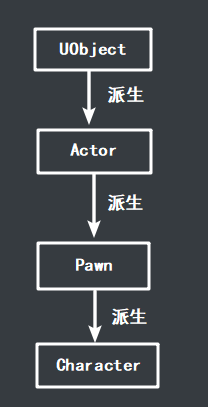

## 2.C++类的创建

### 使用Unreal Editor创建C++类

当我们创建一个C++编程模板时，在内容浏览器中会生成一个C++类文件夹，同时目录下还会生成一个项目名称文件夹，我们可以在对应的文件夹下右键创建一个C++类，选择新类需要继承的父类和存储位置后确定，UE4会自动打开VS，并生成一个`.cpp`文件和一个`.h文件`。

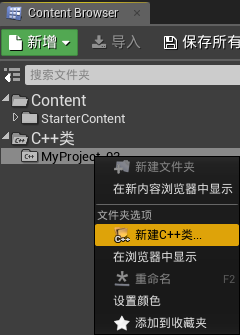

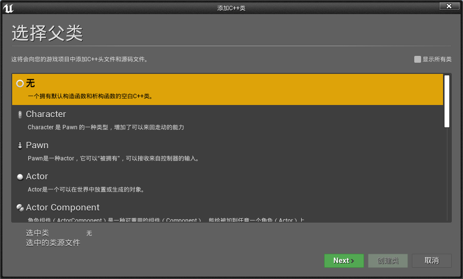

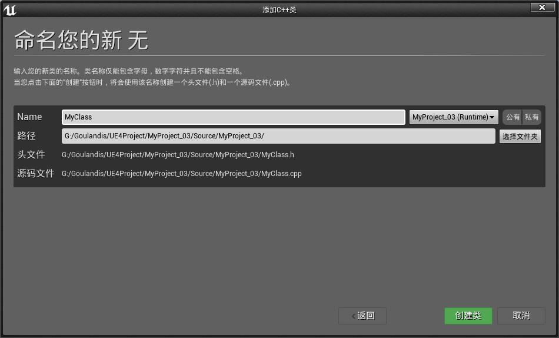

上图有一个要注意的地方，我们在创建类是可以选择后面的公有与私有，或者都不选，选择公有或私有都会在创建一个C++Class/ProjectName文件夹下创建一个Public文件夹存放我们创建的类，而在VS中则会创建一个public文件夹存放.h文件，创建一个private文件夹存放.cpp文件，如果都不选，则.cpp和.h文件都存放在Source文件夹下。

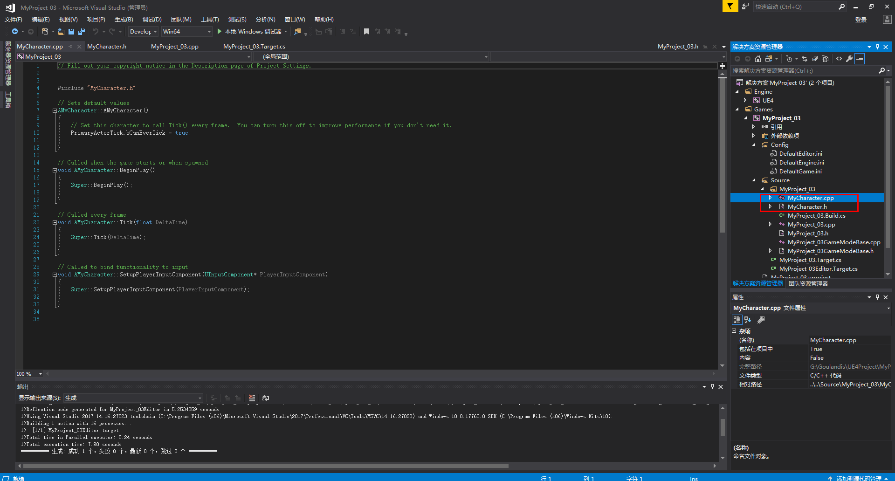

创建的C++类的`.h`文件的结构

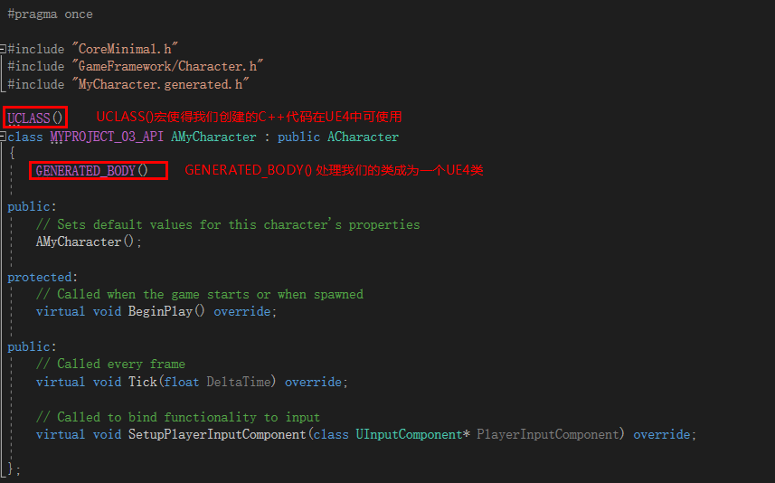

<font color=red> 这里GENERATED_BODY()宏处有两种情况，我们可以使用GENERATED_UCLASS_BODY()宏和GENERATED_BODY()宏，二者的区别是:</font>

<font color=red> 使用了GENERATED_BODY()宏，我们的类中就不能直接使用父类中的声明，如果我们要去实现，我就必须在本类中声明。使用GENERATED_BODY()宏，我们必须手动实现一个无参构造函数。</font>

<font color=red>使用GENERATED_UCLASS_BODY()宏，我们就可以使用父类声明的构造函数，在本类中不需要再声明，而可以直接实现即可，且实现的构造函数必须带const FObjectInitializer&参数。</font>

### 在VS中手动创建类

VS中的工程目录的Source目录下的目录结构有两种：

- 一堆的.cpp、.h和.build.cs文件。
- .h文件在public目录下，.cpp文件在private目录下，.biuld.cs文件在Source目录下.。

对于第一种目录结构，直接在Source文件夹下使用VS添加.cpp和.h文件即可。

对于第二种目录结构，我们需要在public下添加.h文件，在private下添加.cpp文件。

在VS中手动创建的类如果继承UObject，我们需要手动添加UCLASS()宏和GENERATED_BODY()或GENERATED_UCLASS_BODY()宏。

<font color=red> 但是要注意的是手动创建的类系统不会自动为类名加前缀，所以手动创建的类定义类名时应该合乎UE4C++类的命名规范。</font>

### <font color=orange> 小知识</font>

- <font color=orange>UE4中有一个超级奇葩的问题，就是宏GENERATED_BODY()似乎有固定位置（行数）限制，高于或低于这个位置时，VS编译器都会在GENERATED_BODY()处报红，但奇怪的是在UE4引擎中继承自UObject的类运行时不会出错，而继承自Actor的类在GENERATED_BODY()报红时BeginPlay和Tick函数会报错。如下面的图中显示的一样，之所以说他奇葩是因为有的是时候GENERATED_BODY()无论在哪一行却又不会出现这种问题。</font>

  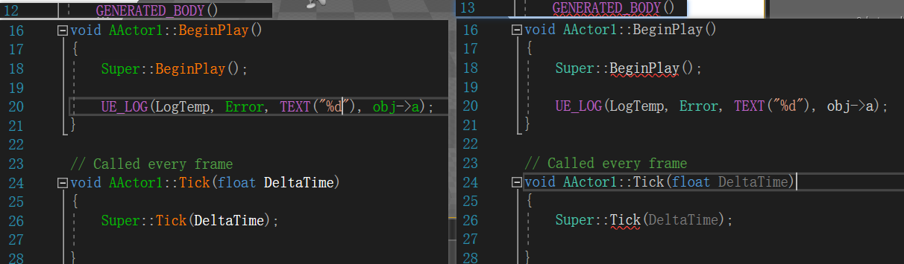

- <font color=orange> UE4中类的成员变量如果直接在类中初始化，类的实例化对象中该成员依然使没有初始化，只有在构造函数中对类的成员变量作的初始化在类的实例中才会被初始化。不知道UE4为什么会有这种现象，在C++中是没有这种现象的。</font>

- <font color=orange> 在我们创建类时时长会碰到.generated.h文件莫名奇妙的就无法打开了，这是我们只需要切换以下VS的编辑模式到DebugGame Editor就可以了。</font>

  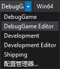

## 2.C++类的删除

UE4引擎自身不提供C++的删除功能，但是有时候我们需要删除一些类的时候怎么办呢？

唯一的办法就是建立在文件操作上了，步骤如下：

- 删除项目目录下Source文件夹下需要删除类的`.cpp`和`.h`文件；
- 清空Binaries/win64文件夹下的所有内容，切记不要整个文件夹都删掉，否则整个项目将无法打开，原因未知；
- 双击.uproject文件，启动项目让引擎重新加载配置。

## 3.UE4类的命名规则

UE4为一些常用类的命名添加了一些命名前缀，<font color=red> 如果我们不写这些前缀，UE4会编译错误</font>。

| 前缀 | 说明                               |
| ---- | ---------------------------------- |
| F    | 纯c++类                            |
| U    | 继承自UObject，但不继承自Actor的类 |
| A    | 继承自Actor的类                    |
| S    | Slate控件相关类                    |
| H    | HitResult相关类                    |

## 4.C++类的实例化

在UE4中实例化C++类稍显复杂，分为如下几种情况：

- 如果是一个纯C++类型的类，即按UE4的命名规则F开头的类，符合C++的实例化条件，可以直接使用new运算符来实例化，或者直接使用构造函数在栈区中实例化；

- 如果是一个继承自UObject但又不继承只Actor的类，那么我们需要使用<font color=red>`NewObject<T>()`</font>函数来实例化类对象；

- 如果是一个继承只Actor类的类，那么我们需要使用我们需要使用UWorld对象中的SpawnActor函数来实例化，调用方式为：<font color=red> `GetWorld()->SpawnActor<T>()`， `GetWorld()->SpawnActor<T>()`不可以在构造函数中使用，如果直接在构造函数中使用UE4在编译时会直接崩溃</font>；

  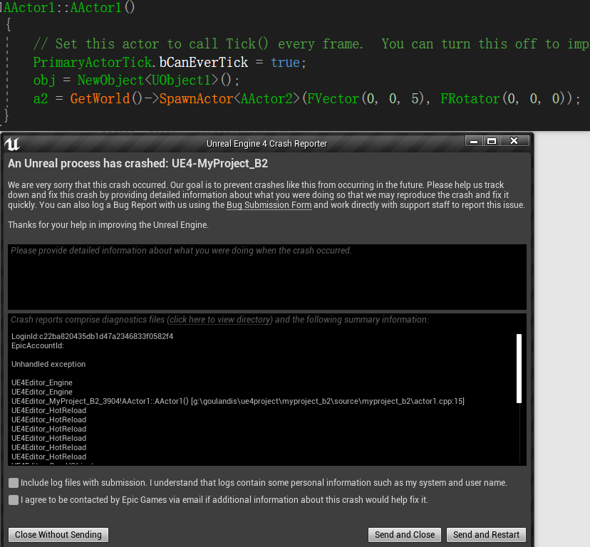

- 如果我们需要产出一个Slate类，那么我们需要使用<font color=red> SNew()</font>函数来实例化。

<font color=red> 这里需要注意的是，当在一个类中实例化另一个类的对象时最好不要构造函数中实例化，尽管NewObject可以在构造函数中使用，并且也可以实例化出对象来，但是如果被实例化的类中包含FString类型的成员变量时，这个对象对FString类型的成员的访问会出现错误，其他的基础数据类型却可以正常访问，具体原因不详。</font>

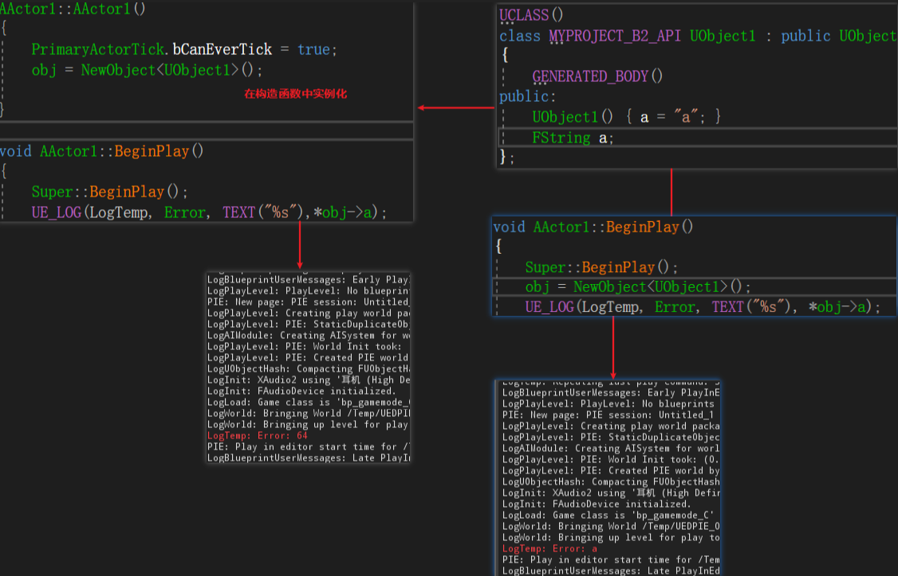

## 4.类的使用

### 继承自UObject类的类

UE4中一个类就是一个实体，但是不是所有的类都可以作为实体编译运行的，只有继承自Actor的类才可以作为一个实体存在，而直接继承自UObject的类则无法直接编译运行，那么我们应该如何让这种情况的类在引擎里编译运行呢？

此时UE4的蓝图类便显现出效果了，什么是蓝图类？<font color=red>蓝图类就类似于Unity中阉割版的预设</font>，任何一个类都可以被创建对应的蓝图类。但是要创建蓝图类还需要做几步操作，我们要想要某个类能被创建蓝图类，那么我们就需要使用UCLASS(Blueprint)在类前说明，编译之后便可以在对应的类对象上右键创建蓝图类，否则创建蓝图类的按钮是非激活状态。

如：

```C++
UCLASS()
class ARP_04_API UTest : public UObject
{
	GENERATED_BODY()
	
};
```

Test类没有声明`UCLASS(Blueprint)`，所以类Test无法创建蓝图类

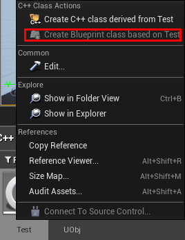

```C++
UCLASS(Blueprintable)
class ARP_04_API UUObj : public UObject
{
	GENERATED_BODY()

public:
	UUObj();
	UPROPERTY(BlueprintReadWrite)
	int UObjInt;
	UFUNCTION(BlueprintCallable)
	void UObjPrint();
};
```

UObj类声明了`UCLASS(Blueprint)`，所以UObj类创建蓝图类的按钮是激活的

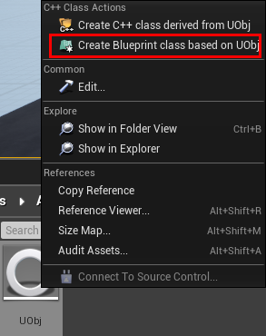

除此之外，我们若想要让类里面的变量和函数也能被蓝图类使用，我同时还需要在变量前指定`UPROPERTY(BlueprintReadWrite)`，在函数前指定`UFUNCTION(BlueprintCallable)`，就如上面的实例代码一样。

UPROPERTY(BlueprintReadWrite)里的参数不是唯一的，<font color=red> BlueprintReadWrite表示成员变量在蓝图类里可读写，BlueprintReadOnly表示成员变量在蓝图类里只读，BlueprintWriteOnly表示成员变量在蓝图类里只写</font>。

经过以上步骤我们的继承自UObject类的类便可以通过对应的蓝图类在关卡蓝图中使用了，使用BeginPlay节点开始程序，使用Construct节点来实例化我们的蓝图类，通过实例化出来的对象便可调用类中的资源了。如：

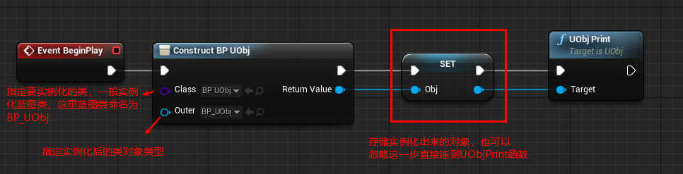

# 五、反射和垃圾回收

UE4使用C++语言进行开发，但是C++并不支持反射和垃圾回收机制，所以UE4便自己实现了反射和垃圾回收。

### 反射

UE4使用一系列的宏来实现反射，在反射中用的宏主要有

| 宏        | 对应的反射对象 |
| --------- | -------------- |
| UCLASS    | C++类          |
| UFUNCTION | 函数           |
| UPROPERTY | 成员变量       |
| USTRUCT   | 结构体         |

<font color = red>要使用这些宏，必须包含头文件`#include "MyActor.generated.h"`，并且这个头文件还必须放在左后一位</font>。

### UE4是如何实现反射的呢？

我们要想要让某一块代码块可以被反射，我们就必须在这个代码块中使用上面的宏，如：我们想要某个类可以被反射，那么就必须在类前添加宏`UCLASS()`，并且面的函数，成员变量，结构体前也必须添加相应的宏。当我们添加了宏后，UE4在编译时会调用中头文件`.generate.h`中相应宏定义有关反射的方法，并通过Unreal Build Tool(UBT)和Unreal Header Tool(UHT)两个工具生成一个`.generate.cpp`文件，`.generate.h`文件则是一个包含了反射数据的C++代码。如此UE4便可以通过`.generate.cpp`来获取元数据。

### 垃圾回收

UE4的垃圾回收的使用有如下几种方式：

**继承自UObject类的类对象**

我们可以直接在成员变量前引入宏<font color=red>UPROPERTY()</font>，这个宏不仅可以标记反射还可以为垃圾回收做标记。

我们也可以是使用<font color=red>TWeakObjectPtr</font>指针，TWeakObjectPtr是一个弱指针，通常定义在类的内部用来操纵堆区中的对象。TWeakObjectPtr是一个泛型指针，使用时需要指定类型参数，如：

```
TWeakObjectPtr<ClassName> tw;
```

**局部的UObject类对象**

有时我们可能在函数中定义一个局部的UObject对象，为了防止对象被UObject的回收机制回收，我们应当使用<font color=red>AddToRoot()</font>来锁定对象，用完后使用<font color=red>RemoveFromRoot()</font>来移除锁定。

**不继承自UObject和UStruct的结构体和类**

这种结构体我们使用<font color=red>TSharedPtr</font>指针来引用堆区的对象，TSharedPtr也是一个泛型指针，使用时也需要指定类型参数。

如果我们想要使用引用而不是指针则使用TSharedRef，如：

```
TSharedRef<FMyCustom> MyCustom = MakeShared<FMyCustom>(); 
```

此时M有Custom就是`MakeShared<FMyCustom>()`返回对象的引用。

我们也可以使用<font color=red>TWeakPtr</font>指针，TWeakPtr指针的效果和TWeakObjectPtr指针的效果是一致的，只是TweakPtr用于非UObject类对象。

**当一个不继承自UObject的结构体中出现了UObject对象时**

这种情况下，结构体可以正常访问，但是结构体里的UObject对象会由于UObject的回收机制，在过一段时间后被销毁，从而导致这个对象无法访问和出现野指针的情况，UE4则使用<font color=red>FGCObject</font>类来解决这种情况，我们只需让这种情况下的结构体继承自FGCObject类积即可。


# 七、宏

UE4中提供大量的宏于开发者使用，这些宏的作用就类似库函数一般。只是需要注意的是，有的宏末尾没有“；”而有的宏末尾需要加“；”，在下面的书写中需要“；”的宏我就直接在末尾加“；”，不需要的则不加。UE4不人性化的一点是很多宏里面的参数在VS中没有提示，也没有颜色变化，更不会提示错误，所以在给宏添加参数时尤其要注意书写正确。

## 1.UE_LOG()；

**作用**

UE_LOG();宏用于向UE4控制台输出内容。

**使用**

UE4提供三个级别的UE_LOG;宏，

```C++
UE_LOG(LogTemp, Log, TEXT("Hello World!"));
UE_LOG(LogTemp, Warning, TEXT("Hello World!"));
UE_LOG(LogTemp, Error, TEXT("Hello World!"));
```

- **LogTemp**：是UE4提供给我们的一个临时UE_LOG();宏标签，这个标签是可以自定义的，如此我们便可以在不同的模块中使用不同标签的UE_LOG();宏，极大的便利了调试，这也是UE_LOG();宏的强大之处。
- **Log/Warning/Error**：这是UE_LOG();宏的三个级别，分别是日志级别--在控制台中输出白色字体；警告级别--在控制台中输出黄色字体，并有Warning提示；错误级别--在控制台中输出红色字体，并有Error提示。
- **TEXT()**：TEXT()也是一个宏用于将我们自定义的额字符串输出到控制台。

**输出变量**

UE_LOG()宏可以输出FString字符串，且字符串类型中只能输出FString。

```
UE_LOG(LogTemp, Error, TEXT("%s"),*str);
```

<font color=red> 使用*str是因为FString是UE4的封装类，定义的FString对象都是指针。</font>

## 2.TEXT()

TEXT()宏是UE4用于字符串转码用的，不使用TEXT()宏的字符串将会使用ASNI编码，而FString可以直接使用字符串赋值是因为FString内部已经对字符串进行了编码处理。

<font color=red> 需要注意的是TEXT()宏不支持中文，如果转码中文UE4在编译时会报错。</font>

## 3.UCLASS()/UPROPERTY()/UFUNCTION()

**作用**

这三个宏主要用于为类(UCLASS())，成员变量(UPROPERTY())和成员函数(UFUNCTION())指定一些特性， **他们用来指定被修饰对象可以被复制、被序列化，并可从蓝图中进行访问。垃圾回收器还使用它们来追踪对 UObject 的引用数。** 

### UCLASS()宏的参数

| 参数                                                   | 作用                                                         |
| ------------------------------------------------------ | ------------------------------------------------------------ |
| **Abstract**                                           | 抽象类说明符将类声明为 “抽象基类”, 防止用户在虚幻编辑器中向世界添加此类的参与者, 或在游戏中创建此类的实例。这对于那些本身没有意义的类很有用。例如, ATriggerBase 基类是抽象的, 而 ATriggerBox 子类别不是抽象的, 您可以在世界上放置一个 ATriggerBox 类的实例, 并且它是有用的, 而 ATriggerBase 的实例本身并不有用 |
| **AdvancedClassDisplay**                               | AdvancedClassDisplay 类说明符强制类的所有属性只显示在 “详细信息” 面板的 “高级” 部分中, 默认情况下隐藏在 “视图” 中。若要在单个属性上重写此项, 请在该属性上使用 SimpleDisplay 说明符 |
| **AutoCollapseCategories**=(Category1, Category2, …)   | 类说明符取消对父类AutoExpandCategories说明符的列出类别的影响 |
| **DontAutoCollapseCategories**=(Category, Category, …) | 否定从父类继承的列出类别的AutoCollapseCategories说明符       |
| **AutoExpandCategories**=(Category1, Category2, …)     | 指定应在该类的对象的 “虚幻编辑器” 属性窗口中自动展开的一个或多个类别。若要自动声明为无类别的变量, 请使用声明变量的类的名称 |
| **Blueprintable / NotBlueprintable**                   | 将此类公开为创建蓝图的可接受基类。默认是NotBlueprintable，除非继承，否则该说明符由子类继承 |
| **BlueprintType**                                      | 将此类公开为可用于蓝图中的变量的类型                         |
| **ClassGroup**=GroupName                               | 表示在Actor浏览器中启用Group View后，虚幻编辑器的Actor浏览器应该在指定的GroupName中包含此类以及此类的任何子类 **CollapseCategories / DontCollapseCategories** |
| **CollapseCategories / DontCollapseCategories**        | 表示不应将此类的属性分组到虚幻编辑器属性窗口中的类别中。这个说明符被传播给子类；但是，子类可以使用DontCollapseCategories说明符来覆盖它 |
| **Config**=ConfigName                                  | 表示允许此类在配置文件 (. ini) 中存储数据。如果有使用 config 或 globalconfig 说明符声明的任何类属性, 则此指定符将导致这些属性存储在命名的配置文件中。此说明符被传播到所有子类, 不能被否定, 但是子类可以通过 re-declaring 配置说明符并提供不同的 ConfigName 来更改配置文件。常见的 ConfigName 值是 “Engine”、”Editor”、”Input” 和 “Game” |
| **Const**                                              | 该类中的所有属性和函数都是const的，并以const的形式导出。该说明符由子类继承 |
| **ConversionRoot**                                     | Root转换将一个子类限制为仅能够转换为第一个Root类的子类，并上升到层次结构 |
| **CustomConstructor**                                  | 阻止自动生成构造函数声明                                     |
| **DefaultToInstanced**                                 | 这个类的所有实例都被认为是“实例化”的。实例化的类（组件）在构建时被复制。该说明符由子类继承 |
| **DependsOn**=(ClassName1, ClassName2, …)              | 列出的所有类将在该类之前编译。类必须在同一个 (或上一个) 包中指定一个类。可以使用由逗号分隔的单个取决于行指定多个依赖项类, 也可以为每个类使用单独的取决于行指定。当类使用在另一个类中声明的结构或枚举时, 这一点很重要, 因为编译器只知道它已编译的类中的内容 |
| **Deprecated**                                         | 这个类不推荐使用，而且这个类的对象在序列化的时候不会被保存。该说明符由子类继承 |
| **EditInlineNew / NotEditInlineNew**                   | 表示可以从 “虚幻编辑器” 属性窗口创建此类的对象, 而不是从现有资产引用。默认行为是只有对现有对象的引用才可以通过属性窗口分配。此说明符被传播到所有子类；子类可以使用 NotEditInlineNew 说明符来重写此说明符 |
| **HideCategories**=(Category1, Category2, …)           | 列出应隐藏在此类对象的 “虚幻编辑器” 属性窗口中的一个或多个类别。若要隐藏声明为 “no” 类别的属性, 请使用声明该变量的类的名称。此说明符被传播到子类 |
| **ShowCategories**=(Category1, Category2, …)           | 为所列出的类别取消一个HideCategories说明符（从基类继承）     |
| **HideDropdown**                                       | 防止在虚幻编辑器属性窗口组合框中显示此类                     |
| **HideFunctions**=(Category1, Category2, …)            | 从属性查看器隐藏指定类别中的所有函数                         |
| **ShowFunctions**=(Category1, Category2, …)            | 在属性查看器中显示列出的类别中的所有功能                     |
| **HideFunctions**=FunctionName                         | 隐藏属性查看器中的指定名称的函数                             |
| **ShowFunctions**=FunctionName                         | 显示属性查看器中的指定名称的函数                             |
| **Intrinsic**                                          | 这表明这个类是直接用C ++声明的，并且没有虚幻头文件工具生成的样板文件。不要在新类上使用这个说明符 |
| **MinimalAPI**                                         | 仅导致要导出的类的类型信息供其他模块使用。类可以被强制转换, 但不能调用类的函数 (内联方法除外)。这提高了编译时间, 因为不为不需要在其他模块中访问所有函数的类导出所有内容 |
| **NoExport**                                           | 表示此类的声明不应包含在由标头生成器自动生成的 c++ 头文件中。必须在单独的头文件中手动定义 c++ 类声明。仅对本机类有效。不要将此用于新类 |
| **Placeable**/**NotPlaceable**                         | 表示可以在编辑器中创建此类, 并将其置于关卡、UI 场景或蓝图中 (具体取决于类类型)。此标志将传播到所有子类；子类可以使用 NotPlaceable 说明符来重写此标志 |
| **Transient**/**NonTransient**                         | 属于此类的对象将永远不会保存到磁盘。这与某些非永久性的自然类 (如播放器或窗口) 结合使用非常有用。此说明符被传播到子类, 但可以由 NonTransient 说明符重写 |
| **Within**=OuterClassName                              | 这个类的对象不能存在于一个OuterClassName对象的实例之外。这意味着创建这个类的Object需要提供一个OuterClassName的实例作为其外部对象 |

参考博客： https://blog.csdn.net/u012793104/article/details/78547655 

### UPROPERTY()宏的参数

| 参数                                             | 作用                                                         |
| ------------------------------------------------ | ------------------------------------------------------------ |
| **AdvancedDisplay**                              | 属性在“详细信息”面板的高级下拉列表中                         |
| **AssetRegistrySearchable**                      | 表明此属性及其值将会为任意将其作为成员变量而包含的资源类示例被自动添加到资源注册中。不可用于结构体属性或参数 |
| **BlueprintAssignable**                          | 仅能用于Multicast代理。应显示该属性，以供在蓝图中分配        |
| **BlueprintCallable**                            | 仅能用于Multicast代理。应显示该属性，以在蓝图代码中调用      |
| **BluprintReadOnly**                             | 设置属性为蓝图只读。会在蓝图脚本中为被修饰的变量提供 Get 方法，没有 Set 方法 |
| **BlueprintReadWrite**                           | 设置属性为蓝图读写。会在蓝图脚本中为被修饰的变量提供 Get 和 Set 方法 |
| **BlueprintGetter**                              | 指定一个自定义存取器函数。如果这个属性没有被标记为BlueprintSetter或者BlueprintReadWrite，那么它就是隐式的BlueprintReadOnly。用法：`BlueprintGetter = GetterFunctionName()` |
| **BlueprintSetter**                              | BlueprintSetter属性有一个自定义的mutator函数，并用BlueprintReadWrite隐式标记。注意，必须指定mutator函数，用法`BlueprintSetter = SetterFunctionName` |
| **Category** = "TopCategory`|`SubCategory`|`..." | 指定在Blueprint编辑工具中显示的属性的类别。使用`|`定义嵌套层级 |
| **Config**                                       | 这个变量将被配置。当前值可以保存到与类关联的.ini文件中，并在创建时加载。无法在默认属性中给出值。意味着ReadOnly |
| **Const**                                        | 这个变量是常量,应该导出为常量。在编辑器中const属性将是不可修改的 |
| **DuplicateTransient**                           | 表示变量值应在任意类型的重复过程中(复制/粘贴， 二进制文件复制等)被重置为类默认值 |
| **EditAnywhere**                                 | 此属性可以通过属性窗口，原型和实例进行编辑（原型指的是类模板，实例指的是具体的对象实例），这里要注意，不要把指针变量设置成EditAnywhere |
| **VisibleAnywhere**                              | 此属性在所有属性窗口中都可见，但无法编辑。这个标签与“Edit”标签不兼容 |
| **EditDefaultsOnly**                             | 该属性可以由属性窗口编辑，但只能在原型上编辑。该操作符与“Visible”标签不兼容 |
| **VisibleDefaultOnly**                           | 此属性仅在原型的属性窗口中可见，并且不能被编辑。这个标签与“Edit”标签不兼容 |
| **EditInstanceOnly**                             | 这个属性可以被属性窗口编辑，但只能在实例上编辑，而不能在原型上编辑。该操作符与“Visible”标签不兼容 |
| **VisibleInstanceOnly**                          | 此属性仅在实例的属性窗口中可见，而不在原型中显示，且无法编辑。这个标签与“编辑”标签不兼容 |
| **EditFixedSize**                                | 只对动态数组有用。这将防止用户通过虚幻编辑器属性窗口更改数组的长度 |
| **EditInline**                                   | 允许用户编辑虚幻编辑器属性检查器中由该变量引用的对象的属性（仅用于对象引用，包括Object引用数组） |
| **Export**                                       | 仅适用于对象属性 (或对象数组)。指示在复制对象 (用于复制/粘贴) 或导出到 T3D 时, 应将分配给此属性的对象整体导出为对象块, 而不是仅输出对象引用本身 |
| **GlobleConfig**                                 | 像Config一样工作，只是你不能在子类中覆盖它。无法在默认属性中给出值。意味着ReadOnly |
| **Instanced**                                    | 对象 (UCLASS) 属性。创建此类的实例时, 将为默认情况下分配给该变量的对象提供一个唯一的副本。用于在类默认属性中定义的实例子。类似 EditInline 和 Export 修饰符 |
| **Interp**                                       | 表示该值可由Matinee的浮点或向量属性轨迹来随时间驱动          |
| **Localized**                                    | 此变量的值将定义本地值。最常用于字符串。ReadOnly             |
| **Native**                                       | C++代码负责对其序列化并显示给GC                              |
| **NoClear**                                      | 防止该对象引用在编辑器中被设置为None.隐藏编辑器的清除（以及浏览）按钮 |
| **NoExport**                                     | 仅对native类有效。此变量不应被包含在自动生成的类声明中       |
| **NonPIEDuplicateTeansient**                     | 在复制过程中，该属性将被重置为默认值，除非复制PIE会话        |
| **NonTransactional**                             | 表示对此变量值所做的更改将不会包含在编辑器的撤销/重做历史记录中 |
| **NotReplicated**                                | 跳过复制。这只适用于服务请求函数中的结构成员和参数           |
| **Ref**                                          | 该值在函数调用后被复制出来。仅在函数参数声明中有效           |
| **Replicated**                                   | 变量应通过网络进行复制                                       |
| **ReplicatedUsing** = FunctionName               | ReplicatedUsing标签指定了一个回调函数，当通过网络更新变量时执行回调函数 |
| **RepRetry**                                     | 仅用于结构体属性。如无法被完全发送，请重试复制此属性（例如，对象引用尚无法通过节点网络来进行序列化）。对于简单引用来说，这是一个默认值，但对结构体来说，由于带宽消耗，很多情况下我们不需要。所以除非此标识被定义，否则其会被禁用 |
| **SaveGame**                                     | 此说明符是一种简单的方法，可以在属性级别为检查点/保存系统显式包含字段。该标志应设置在所有意图成为已保存游戏一部分的字段上，然后可使用代理归档程序对其进行读取/写入 |
| **SerializeText**                                | 应将Native属性序列化为文本（ImportText，ExportText）         |
| **SkipSerialization**                            | 该属性不会被序列化，但仍然可以导出为文本格式（例如复制/粘贴） |
| **SimpleDisplay**                                | “Visible”或“Edit”属性显示在“详细信息”面板中，不显示“高级”部分即可见 |
| **TextExportTransient**                          | 此属性不会被导出为文本格式（例如复制/粘贴）                  |
| **Transient**                                    | 属性是暂时的，这意味着它不会被保存或加载。以这种方式标记的属性在加载时将被填满 |

参考博客： https://blog.csdn.net/u012793104/article/details/78480085 

UPROPERTY()宏提供了一些元数据说明符，元数据说明符可以对变量做一些限制，比如输入值的大小限定在某一个范围内，如：

```C++
UPROPRETY(meta=(ClampMin=-5.0f,ClampMax=5.0f,UIMin=-5.0f,UIMax=5.0f))
```

详细的说明参官方文档： https://docs.unrealengine.com/zh-CN/Programming/UnrealArchitecture/Reference/Metadata/index.html 

### UFUNCTION()宏的参数

| 参数                                                   | 作用                                                         |
| ------------------------------------------------------ | ------------------------------------------------------------ |
| **BlueprintAuthorityOnly**                             | 如果在具有网络权限的计算机（服务器，专用服务器或单人游戏）上运行，此功能只能从Blueprint代码执行,如无网络权限，则该函数将不会从蓝图代码中执行 |
| **BlueprintCallable**                                  | 该函数可以在蓝图或关卡蓝图图表中执行                         |
| **BlueprintCosmetic**                                  | 此函数为修饰函数而且无法运行在专属服务器上                   |
| **BlueprintGetter**                                    | 修饰自定义的Getter函数专用，该函数将用作Blueprint暴露属性的访问器。这个说明符意味着BlueprintPure和BlueprintCallable。参考：https://blog.csdn.net/u012793104/article/details/78480085 |
| **BlueprintSetter**                                    | 修饰自定义的Setter函数专用，此函数将用作Blueprint暴露属性的增变器。这个说明符意味着BlueprintCallable。参考：https://blog.csdn.net/u012793104/article/details/78480085 |
| **<font color=red>BlueprintImplementableEvent</font>** | 此函数可以在蓝图或关卡蓝图图表内进行重载*不能修饰private级别的函数，函数在C++代码中不需要实现定义* |
| **BlueprintInternalUseOnly**                           | 表示该函数不应该暴露给最终用户                               |
| **BlueprintNativeEvent**                               | 此函数将由蓝图进行重载，但同时也包含native类的执行。提供一个名称为[FunctionName]_Implementation的函数本体而非[FunctionName];自动生成的代码将包含转换程序,此程序在需要时会调用实施方式 |
| **BlueprintPure**                                      | 该函数不会以任何方式影响拥有对象，并且可以在蓝图或级别蓝图图表中执行 |
| **CallInEditor**                                       | 该函数可以在编辑器中通过详细信息面板中的按钮在选定实例中调用 |
| **Category** = "TopCategory`|`SubCategory\|..."        | 指定函数在编辑器中的显示分类层级，`|`是分层级的符号          |
| **Client**                                             | 此函数仅在该函数从属对象所从属的客户端上执行。提供一个名称为[FunctionName]_Implementation的函数主体，而不是[FunctionName]; 自动生成的代码将包含一个转换程序来在需要时调用实现方法 |
| **CustomThunk**                                        | UnrealHeaderTool（虚幻头文件工具）的代码生成器将不会为此函数生成execFoo转换程序; 可由用户来提供 |
| **Exec**                                               | 此函数可从游戏中的控制台中执行。Exec命令仅在特定类中声明时才产生作用,此标记修饰的函数应在可以接受输入的类中，才能正常接受命令 |
| **NetMilticast**                                       | 无论角色的NetOwner如何，该函数都在服务器上本地执行并复制到所有客户端 |
| **Reliable**                                           | Reliable函数在网络间进行复制，并会忽略带宽或网络错误而被确保送达。仅在与客户端或服务器共同使用时可用 |
| **UnReliable**                                         | UnReliable函数在网络间复制，但可能会由于带宽限制或网络错误而传送失败。仅在与客户端或服务器一起使用时有效 |
| **SealeEvent**                                         | 这个函数不能在子类中重写。 SealedEvent关键字只能用于事件。对于非事件函数，声明它们是static的还是final的来封闭它们 |
| **ServiceRequest**                                     | ServiceRequest函数是一个RPC服务请求                          |
| **ServiceResponse**                                    | ServiceResponse函数是一个RPC服务响应                         |
| **Server**                                             | 此函数仅在服务器上执行。提供一个名称为[FunctionName]_Implementation的函数主体，而不是[FunctionName]; 自动生成的代码将包含一个转换程序来在需要时调用实现方法 |
| **WithValidation**                                     | 声明一个名为与main函数相同的附加函数，但将_Validation添加到最后。该函数采用相同的参数，并返回一个布尔值来指示是否应该继续调用主函数 |

UFUNCTION()宏也提供了元数据说明符，元数据说明符可以对参数做一些限制，这里不再列出，详细的说明参官方文档： https://docs.unrealengine.com/zh-CN/Programming/UnrealArchitecture/Reference/Metadata/index.html 

## 4.GENERATED_BODY()

GENERATED_BODY()宏标识的类表示，此类不可以使用父类的声明，最常见的就是GENERATED_BODY标识的类必须要自己声明和实现无参构造函数，否则编译将无法通过。

## 5.GENERATED_UCLASS_BODY()

GENERATED_UCLASS_BODY()宏标识的类表示此类继承父类的声明，最常见的就是GENERATED_UCLASS_BODY()标识的类不需要声明构造函数，如果需要重写构造函数，则必须为构造函数传递FObjectInitializer类的常量引用，这也是为什么我们经常在UE4编程中看见如下代码的缘故

```C++
UMySQLDatabase::UMySQLDatabase(const FObjectInitializer& ObjectInitializer)
	: Super(ObjectInitializer)
{
        //重写块
}
```

其中Super()y用于给父类传递参数

<font color=red> GENERATED_BODY()和GENERATED_UCLASS_BODY()宏都会为其标识的类生成一些成员函数，只是二者在使用权限上有一些区别，具体生成了什么成员函数及其区别由于目前自己搜索到的资料过少，暂时无法弄明白，需要以后慢慢研究</font>。

# 八、字符串操作

## 1.FString

FString是UE4C++编程中极其常用的一个UE4字符串封装类型，是UE4自带字符串类型中唯一可以进行各种字符串操作的字符串类型，同时FString的资源消耗也是最大的。

### FString初始化

- 方法1：

```C++
FString fStr = FString(TEXT("str")); 
```

- 方法2：

```C++
FString fStr = FString("str"); 
```

- 方法3：

```C++
FString fStr = "str"; 
```

### FString转换

- FString->FName：

```c++
FName fn = FName(*fStr);
```

- FString->FText：

```
FText ft = FText::FromString(fStr)
```

- FString->bool

```
bool b = fstr.ToBool();
```

- FString->int

```
int i = FCString::Atoi(*fstr);
```

- FString->float

```
float f = FCString::Atof(*fstr)
```


- FString->std::string

- std::string->FString

```

```

- FName->FStirng：

```C++
FString fstr = fn.ToString();//fn为FName类型
```

- FText->FString

```C++
FString fstr = ft.ToString();//ft为FText类型
```

- float->FString

```C++
FString fstr = FString::SanitizeFloat(FloatValue);
```

- int->FString

```
FString fstr = FString::FromInt(IntValue);
```

- bool->FString

```
FString fstr = InBool?TEXT("true"):TEXT("false");
```

- FVector->FString

```
FString fstr = VectorVariable.ToString();
```

- FVector2D->FString

```
FString fstr = Vector2DVariale.ToString();
```

- FRotator->FString

```
FString fstr = RotatorVariable.ToString();
```

- UObject->FString

```
FString fstr = (InObj != NULL)?InObj->GetName():FString(TEXT("None"));
```

## 2.FName

FName也是UE4自带的字符串类型，FName是不区分大小写的且FName在UE4中，赋予FName的字符串会被存放到UE4的数据表中，多个FName赋予相同的字符串时都会指向同一个数据表地址。FName被赋值之后不可改变也不能被操作，FName的不可改变的性质和C++的string类很相似，因为FName的这些性质是的FName的查找和访问非常快。

- FName的初始化

```C++
FName fn1 = FName(TEXT("str"));
FName fn2 = FName("str");
FName fn3 = "str";
```

## 3.FText

FText是一个FString的升级版字符串，存储容量比FString要大很多，主要用于UE4的文本存储与处理。

# 八、UE4的碰撞检测

## 1.添加碰撞体

UE4中碰撞体只能为模型添加，单独创建的Actor类是没有办法添加碰撞体的，我们要给Actor添加碰撞体就必须先给予Actor一个mesh组件，然后在这个组件上赋予模型，然后再在模型上添加碰撞体，这样Actor便拥有了碰撞体。

UE4提供多种生成碰撞体的方法


## 2.物理碰撞

在UE4中想要启用物理碰撞相对来说比较简单，我们秩序将蓝图类中physics下的Simulate Physics勾选上，游戏物体便既有了物理属性。

## 3.碰撞通道


## 4.碰撞检测

# 九、UE4 Module机制


# 、常用函数

| 函数名                                                    | 作用                                                         |
| --------------------------------------------------------- | ------------------------------------------------------------ |
| CreateDefaultSubobject<T>(TEXT(string str));              | 为当前Actor创建一个静态网格，报错时提示字符串str             |
| SetActorLocation(FVector postion)                         | 设置当前Actor的位置坐标，FVector是UE4中的三维向量类          |
| AddActorLocalOffset(FVector offset)                       | 设置当前Actor的移动偏移量                                    |
| *UStaticMeshComponent->AddForce(FVector force)            | 给当前Actor添加力，需要使用UStaticMeshComponent指针来调用，且需要包含#include "Components/StaticMeshComponent.h"，否则无法调用，可以使用AddForce(FVector force，"NAME_None"，bool b)通过bool值来确定是否忽略质量影响 |
| *UStaticMeshComponent->AddTorque(FVector force)           | 给当前Actor添加力矩，需要使用UStaticMeshComponent指针来调用，且需要包含#include "Components/StaticMeshComponent.h"，否则无法调用，可以使用AddTorque(FVector force，"NAME_None"，bool b)通过bool值来确定是否忽略质量影响 |
| RootComponent=CreateDefaultSubobject<T>(Text(string str)) | 为当前的Actor(继承自Actor的类都属于Actor类)设置根节点，并命名为str，RootComponent是UE4提供一个载入根节点的容器 |
| *T->SetupAttachment(T root)                               | 将root设置成T类型指针指向对象的父节点，需要Components/StaticMeshComponent.h头文件的支持 |

# 十、UE4Z中一些常用的类

| 类命                 | 含义             |
| -------------------- | ---------------- |
| UStaticMeshComponent | 处理材质贴图的类 |
| FVector              | 三维向量类       |
| FMath                | 数学运算类       |
| USceneComponent      | 场景组件         |
| UStaticComponent     | 静态网格组件     |
| UCameraComponent     | 相机组件         |


# Actor和Object迭代器

# UE4共享指针