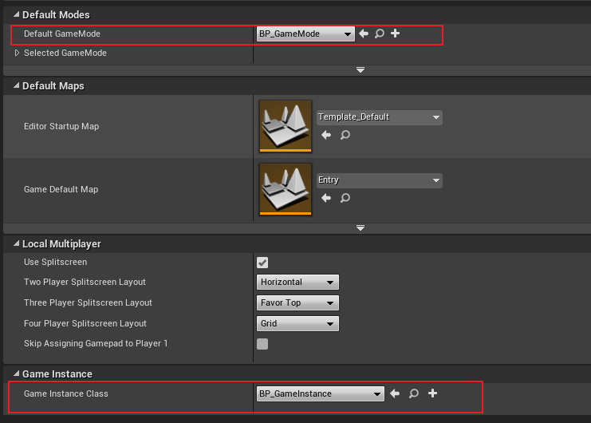

# 一、基于C++的服务器

当然服务器也是可以使用UE4写的，不过对于一般的不需要UI的服务器来说，直接使用C++控制台程序编写要方便得多。

## 1.所需头文件和静态库

`#include <winsock.h>`

`#pragma comment(lib "ws2_32.lib")`

<font color=red> 需要注意的是，winsock.h是Windows环境使用的头文件，对于其他的环境需要使用其他的头文件，如在Linux下使用的是socket.h。</font>

有的时候也是用winsock2.h，winsockt2.h是winsockt.h的升级版，一个文件中不可同时存在winsockt.h和winsockt2.h，因为winsockt2.h中有重定义winsockt.h中的内容。

## 2.创建套接字

**Server.h**

```C++
#include <winsock.h>

#pragma comment(lib, "ws2_32.lib")

class Server
{
public:
	WSADATA wsd;//存放套接字的属性，如：版本信息等
	SOCKET serverSocket;
	SOCKET clientSocket;
	SOCKADDR_IN serverAddr;//用于设置套接字使用的地址类型，端口和

	Server(int port);
	~Server();

	SOCKET ClientListen();
	void Receive(SOCKET clientSocket);
};
```

**创建套接字**

```C++
Server::Server(int port)
{
	//打开2.2版本的套接字，注册套接字
	if (WSAStartup(MAKEWORD(2, 2), &wsd) != 0)
	{
		cout << "初始化套接字动态库错误" << endl;
		return;
	}
	//创建套接字，AF_INET--使用Inter使用，SOCK_STREAM--使用流式传输，IPPROTO_TCP--使用TCP连接
	serverSocket = socket(AF_INET, SOCK_STREAM, IPPROTO_TCP);
	if (serverSocket == INVALID_SOCKET)
	{
		cout << "套接字创建失败" << endl;
		WSACleanup();//注销套接字
		return;
	}

	serverAddr.sin_family = AF_INET;//配置地址类型为InterIP
	serverAddr.sin_port = htons(port);//配置占用端口
	serverAddr.sin_addr.S_un.S_addr = INADDR_ANY;//接受任何IP类型
	//将IP和端口与套接字绑定
	int ret = bind(serverSocket, (LPSOCKADDR)&serverAddr, sizeof(SOCKADDR_IN));
	if (ret == SOCKET_ERROR)
	{
		cout << "套接字绑定失败" << endl;
		closesocket(serverSocket);//关闭套接字
		WSACleanup();
		return;
	}
}
```

其间也可以加一个版本判断，判断注册的套接字是否是2.2版本的

```C++
if (LOBYTE(wsd.wVersion != 2 || HIBYTE(wsd.wVersion) != 2))
{
	cout << "套接字版本错误，需要打开2.2版本的套接字" << endl;
	WSACleanup();
	return;
}
```

## 3.套接字监听

C++没有提供专门的异步套接字监听方法，如果不想使用阻塞的方式，即同步方式监听套接字的话，就需要通过线程来实现异步监听了。

```C++
SOCKET Server::ClientListen()
{
	int ret = listen(serverSocket, SOMAXCONN);//开启套接字监听，SOMAXCONN--监听队列设为最大
	if (ret == SOCKET_ERROR)
	{
		cout << "监听时发生错误" << endl;
		closesocket(serverSocket);
		WSACleanup();
		return NULL;
	}
	sockaddr_in clientAddr;//用于存储接收到的客户端的地址信息
	int clientAddrLen = sizeof(clientAddr);
    //接受serverSocket缓冲区里clientAddrlen长度的内容，即一个套接字
	SOCKET clientSocket = accept(serverSocket, (sockaddr FAR*)&clientAddr, &clientAddrLen);
	if (clientSocket == INVALID_SOCKET)
	{
		cout << "接受客户端时发生错误" << endl;
		closesocket(serverSocket);
		WSACleanup();
		return NULL;
	}
	cout << "接受到客户端" << endl;
	return clientSocket;
}
```

## 4.接受消息

获取到客户端的套接字后，就可以就收客户端发送过来的消息了。

```C++
void Server::Receive(SOCKET clientSocket)
{
	char receiveBuff[50];//接受消息内容缓冲数组
    //接受消息
	recv(clientSocket, receiveBuff, strlen(receiveBuff), 0);
	printf("%s\n", receiveBuff);
}
```

## 5.发送消息

```C++
void Server::Send(SOCKET clientSocket, char * sendBuff)
{
    //发送sendBuff发送消息数组钟的内容到clientSocket套接字
	send(clientSocket, sendBuff, strlen(sendBuff) + 1, 0);
}
```

# 二、GameMode与GameInstance

由于UE4在换关卡的时候会删除世界大纲中的上一关卡中的所有的内容，所以对于需要在整个游戏运行期间都必须工作的套接字来说，需要在一个从游戏开始运行到游戏程序关闭都存在的场所中工作，这个场所就是GameInstance，而使用自定义GameInstance需要用到GameMode，所以在写UE4客户端套接字之前，我们有必要先了解GameInstance和GameMode。

## 1.GameInstance

要了解GameInstance，首先我们要对UE的引擎结构有一点点的了解。

UE的宇宙是由UEngine这个创世神管理的各个World组成的，每个World就是一个个平行世界，编辑模式是一个World，运行模式是一个World，而每个World又由各个Level组成，每个Level又由各个Actor组成，而每个Actor拥有各种不同Component从而形成了各式各样的Actor，于是多姿多彩的UE世界便展开了，而GameInstance就是凌驾于World之上的存在。

<font color=red> GameInstance的生命周期就是整个游戏进程的生命周期，从游戏开始到游戏程序关闭，并且GameInstance在整个游戏进程中只存在一个对象，即单例，就如名字一般</font>。所以任何凌驾于Level和World之上的逻辑都应该在GameInstance中保存和实现，比如游戏网络连接，因为Level在切换时UE4会清空上一个Level在世界大纲中所有内容，然后加载下一个Level的内容，此时如果把游戏网络连接的逻辑放在Level或World中，这些逻辑就会被清空，在上一个Level内容被清空到下一个Level中重新加载网络连接逻辑的期间游戏会处于网络孤立状态。在游戏运行期间World在任意时刻其实都是是唯一的，为什么网络连接的逻辑不能放在World中，而要放在GameInstance中呢?这是因为UE在加载新的Level时，其实是在销毁前一个World，创建了一个新的World。但是World依然只有一个。

**使用GameInstance**

使用GameInstance的方法很简单，就是创建一个类继承自UGameInstance的子类，这个子类就继承到了GameInstance的所有属性了。

但是GameInstance不存在于世界大纲中该如何执行在其中实现的逻辑代码呢？这就是我们接下来要来了解的GameMode的事了。

## 2.GameMode

首先我们需要知道什么是GameMode，在UE4里GameMode是对应World层存在的，UE4给予GameMode的职责就是处理与实现游戏逻辑，即游戏的玩法，这里我们要区分GameMode与LevelBlueptint，LevelBlueprint是对应Level存在在，每一个Level有且只有一个LevelBlueprint，而GameMode是对应World存在的，每一个World有且只有一个GameMode，但是一个UE4游戏中是可以有多个GameMode，就像一个游戏可以有多种规则玩法一样。

在UE4里GameInstance里的内容可以被全局调用，那么我们为什么要使用GameMode来实现网络连接而不是用更易理解的LevelBlueprint呢？这是因为GameMode提供了内容在拥有不同GameMode的World中迁移的能力，加以大多数游戏一般只有一中游戏规则，即一个GameMode，所以在GameMode中做网络连接的逻辑是较为恰当的。

**使用GameMode**

GameMode实质上是一个继承自GameModeBase的蓝图类，我们只需创建一个继承自GameModeBase的GameMode，就可以在GameMode中编写蓝图脚本调用C++函数来实现游戏逻辑了，为什么在GameMode中只进行函数调用呢？因为如果所有的代码逻辑都在GameMode中实现就会显得GameMode过于臃肿，所以GameMode一般进行函数调用，而函数的实现则在C++类中处理。

至此，客户端的网络部分的代码逻辑在什么地方编写就基本确定了。

# 三、UE4客户端

## 1.前提准备

- UE4编写网络模块的逻辑需要在.Build.cs文件里添加两个模块<font color=red> "Sockets", "Networking"</font>；

- 创建一个继承自UGameInstance的类作为网络部分的代码实现模块；

- 创建一个继承自GameModeBase的GameMode，并在Settings/Project Settings/Maps&Mode下设置项目默认的GameMode和GameInstance。

  

## 2.连接服务器

**.h**

```C++
#pragma once
#include "FReceiveThread.h"
#include "Runtime/NEtworking/Public/Networking.h"
#include "CoreMinimal.h"
#include "Engine/GameInstance.h"
#include "ServerConnector.generated.h"

UCLASS()
class MYGAME_API UServerConnector : public UGameInstance
{
	GENERATED_BODY()
private:

	FSocket *connectSocket;
	FIPv4Address ip;
	TSharedPtr<FReceiveThread> receiveThread;

public:

	FString msg;

public:
	UServerConnector() {}
	//create socket and connect server
	UFUNCTION(BlueprintCallable,Category="ClientSocket")
	bool ServerConnect(FString ip,int32 port);
	//send message to server
	UFUNCTION(BlueprintCallable, Category = "ClientSocket")
	bool Send(FString msg);
	//receive message from server
	UFUNCTION(BlueprintCallable, Category = "ClientSocket")
	bool Receive();
	
};
```

**连接Server**

```C++
bool UServerConnector::ServerConnect(FString ip, int32 port)
{
	FIPv4Address::Parse(ip,this->ip);//将字符串表示的ip转换成点分十进制的ip
    //创建服务器套接字地址，PLATFROM_SOCKTSUBSYSTEM--选择当前系统的套接字
	TSharedPtr<FInternetAddr> addr = ISocketSubsystem::Get(PLATFORM_SOCKETSUBSYSTEM)->CreateInternetAddr();
	addr->SetIp(this->ip.Value);//向套接字地址绑定服务器ip
	addr->SetPort(port);//向套接字地址绑定服务器端口
    //创建客户端套接字，NAME_Stream--使用流式传输，Default--套接字描述，false使用TCP，Ture使用UDP连接
	connectSocket = ISocketSubsystem::Get(PLATFORM_SOCKETSUBSYSTEM)->CreateSocket(NAME_Stream, TEXT("Default"), false);
	if (!connectSocket->Connect(*addr))//连接服务器
	{
		UE_LOG(LogTemp, Error, TEXT("ServerConnector.cpp:Connect Failed"));
		return false;
	}
	UE_LOG(LogTemp, Error, TEXT("Connect Succeed"));
	return true;
}
```

## 3.发送消息

```C++
bool UServerConnector::Send(FString msg)
{
    //将字符串形式的消息转换成TCHAR*类型，因为二进制流的转换只支持TCHAR类型
	TCHAR *seriallizedChar = msg.GetCharArray().GetData();
	int32 size = FCString::Strlen(seriallizedChar) + 1;//计算消息的内存大小
	int32 sent = 0;//这一行是Send函数的格式要求，提供给Send内部使用的参数
    //将消息转化成二进制流并向服务器发送消息
	if (!connectSocket->Send((uint8*)TCHAR_TO_UTF8(seriallizedChar), size, sent))
	{
		UE_LOG(LogTemp, Error, TEXT("Message Send Failly"));
		return false;
	}
	UE_LOG(LogTemp, Error, TEXT("Message Send Successlly"));
	return true;
}
```

## 4接受消息

接受消息就需要使用到UE4线程了，那么首先我们就需要了解UE4线程。

在UE4中线程就是一个继承自FRunnable的类，我们创建这个类的对象的同时就开启了线程，<font color=red> 要注意的是继承自FRunnable的类是一个自定义类，即以F开头的类，并且自定义类在UE4的内容浏览器中是不显示的</font>。

**需要包含的头文件**

- #include "Runnable.h"

- #include "RunnableThread.h"

  或者我们也可以直接只包含#include "ThreadingBase.h"头文件，ThreadingBase.h里面就已经包含了线程所需要的所有的头文件

### **.h**

```C++
#pragma once

#include "CoreMinimal.h"
#include "Runnable.h"
#include "RunnableThread.h"
#include "Networking.h"
//#include "ThreadingBase.h"

class MYGAME_API FReceiveThread : public FRunnable
{
private:

	FRunnableThread* thread = nullptr;	
	bool threadRuning;
	FSocket* socket;//需要读取消息的线程

public:

	FString msg;

private:	
	
	virtual uint32 Run() override;
	virtual void Stop() override;

public:
	FReceiveThread(FSocket* socket);
	~FReceiveThread();;

};
```

**.cpp**

```C++
#include "FReceiveThread.h"

FReceiveThread::FReceiveThread(FSocket* socket)
{
	this->socket = socket;
	thread = FRunnableThread::Create(this, TEXT("ReceiveThread"), 0);
	threadRuning = true;
}

uint32 FReceiveThread::Run()
{
	if (!socket) return 0;
	TArray<uint8> buff;
	int32 readType = 0;
	while (threadRuning)
	{
		buff.Init(0, 1024u);
		socket->Recv(buff.GetData(), buff.Num(), readType);
		msg = FString(ANSI_TO_TCHAR(reinterpret_cast<const char*>(buff.GetData())));
		UE_LOG(LogTemp, Error, TEXT("%s"), *msg);
	}
	return 1;
}

void FReceiveThread::Stop()
{
	threadRuning = false;
	if (thread) thread->WaitForCompletion();
}

FReceiveThread::~FReceiveThread()
{
	threadRuning = false;
	delete thread;
	thread = NULL;
}
```


