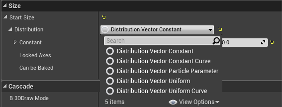
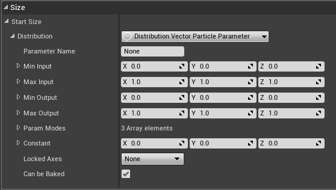
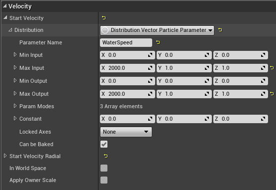
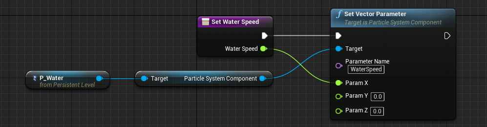
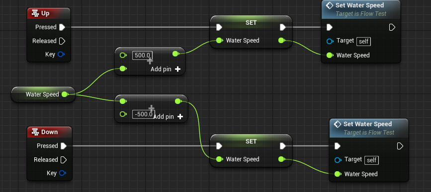
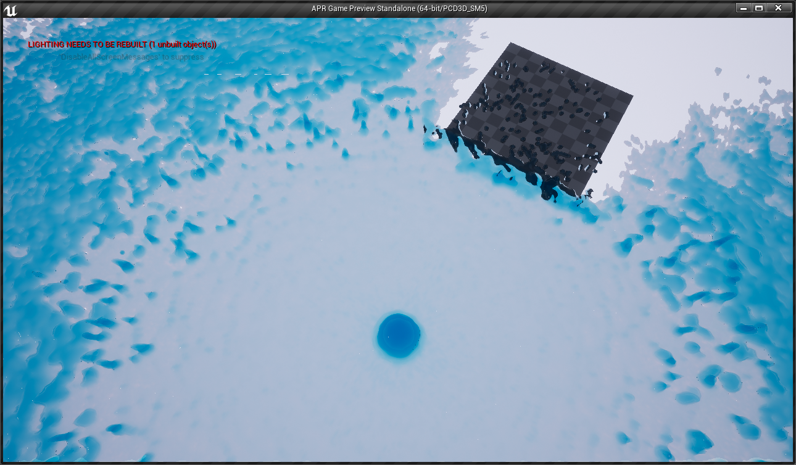
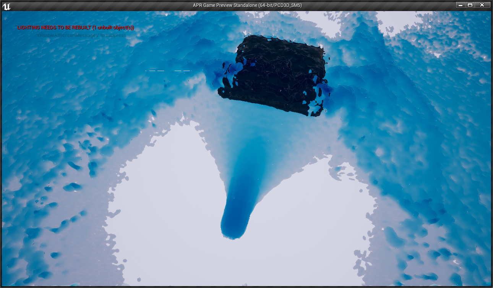
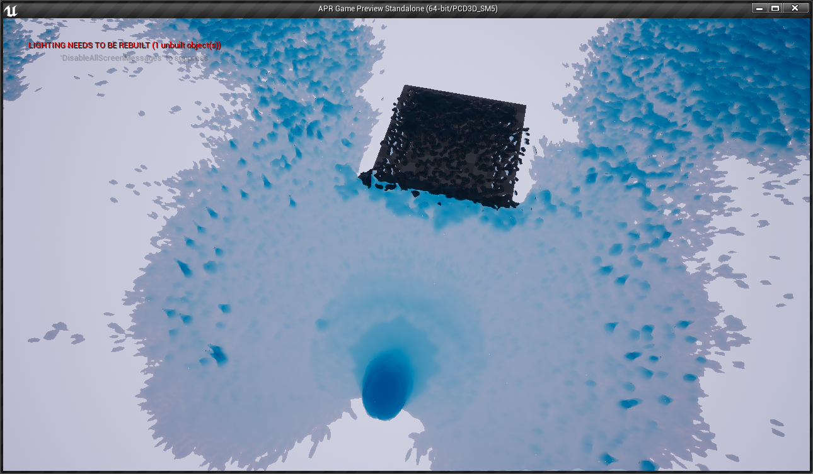

如果对UE4联级粒子P_Water系统比较熟悉的可能对动态修改粒子参数不陌生。

UE4的联级粒子系统大部分的模块都拥有一个 Distribution子栏，其中可以选择如下模式

其中 Distribution Vector Particle Parameter就是参数模式，选择之后Distribution栏会变成这样

其中Parameter Name就是参数的名字，在蓝图调用参数时需要用到。Min Input、Max Input、Min Output、Max Output分别限制参数的的最小输入、最大输入、最小输出、最大输出。

UE4的粒子系统提供8中类型的参数供外部控制：

- Actor Parameters
- Auto Attachment Parameters
- Color Parameters
- Float Parameters
- Float Rand Parameters
- Material Parameters
- Vector Parameters
- Vector Rand Parameters

8中参数类型的用法是一样的，这里我们以Vector Parameters，用以修改粒子的发射速度Initial Velocity为例。

首先将Initial Velocity模块的的Velocity/Start Velocity/Distribution选择Distribution Vector Particle Parameter模式，在Parameter Name栏设置参数名字为WaterSpeed，再设置好输入输出限制。

然后就可以在蓝图中使用这个参数了，首先打开关卡蓝图，我这里创建一个专门的函数SetWaterSpeed用来修改这个参数，蓝图脚本如下：

P_Water是放在场景中的粒子系统，获取粒子系统的ParticleSystemComponent粒子系统组件，这样就可以通过Set Vector Parameter函数来获取组上指定名字的参数了，由于Set Vector Parameter是按名字来获取参数的，所以同一种类型参数尽量不要重名。

然后进行函数调用。

测试一下粒子发射速度是否改变

初始状态

按下Up键后

按下Down键后

目前尚未找到如何读取粒子系统的参数的方法。