UE4嵌入Web及UE4到Web的通信，我使用UE 4.22.3版本，以UE4嵌入ECharts并与ECharts通信为例。

# 一、自定义WebBrowser

UwebBrowser是UE4自带的用于浏览Web的插件类，为了后面进行UE4与Web的通信，所以这里我们需要自定义一个UWebBrowser类。

## 1.创建自定义WebBrowser类

在C++ Classes中右键创建一个自己的继承自widget类的C++类--MyWebBrowser。

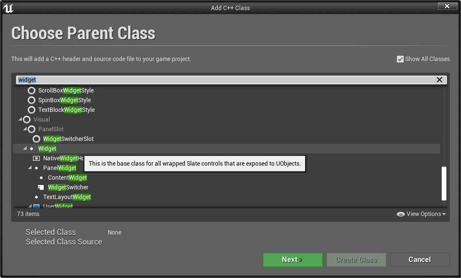

## 2.编写自定义WebBrowser

然后在VS中搜索WebBrowser.cpp和WebBrowser.h这是UE4自带的WebBrowser类，虽说是写一个自定义的WebBrowser，但是我们的自定义的WebBrowser在功能上基本和UE4自带的webBrowser一致，所以我们只需将UE4自带的WebBrowser中的代码拷贝到我们自己的MyWebBrowser中稍作修改即可。

当然拷贝时不是全盘拷贝，只需拷贝如下WebBrowser.h中虚线一下的部分拷贝到我们的MyWebBrowser.h中。有时可能出现FOnUrlChanged和FOnBeforePopup报错，等VS反应一下就好了，有时可以直接编译，报红也是可以编译通过的。

```C++
/*WebBrowser.h*/

#pragma once
#include "Components/Widget.h"
#include "WebBrowser.generated.h"

UCLASS()
class WEBBROWSERWIDGET_API UWebBrowser : public UWidget
{
    /*--------------------------------------------------------------------------------------*/
	GENERATED_UCLASS_BODY()

public:
	DECLARE_DYNAMIC_MULTICAST_DELEGATE_OneParam(FOnUrlChanged, const FText&, Text);
	DECLARE_DYNAMIC_MULTICAST_DELEGATE_TwoParams(FOnBeforePopup, FString, URL, FString, Frame);

	/**
	 * Load the specified URL
	 *
	 * @param NewURL New URL to load
	 */
	UFUNCTION(BlueprintCallable, Category="Web Browser")
	void LoadURL(FString NewURL);

	/**
	 * Load a string as data to create a web page
	 *
	 * @param Contents String to load
	 * @param DummyURL Dummy URL for the page
	 */
	UFUNCTION(BlueprintCallable, Category="Web Browser")
	void LoadString(FString Contents, FString DummyURL);

	/**
	* Executes a JavaScript string in the context of the web page
	*
	* @param ScriptText JavaScript string to execute
	*/
	UFUNCTION(BlueprintCallable, Category = "Web Browser")
	void ExecuteJavascript(const FString& ScriptText);

	/**
	 * Get the current title of the web page
	 */
	UFUNCTION(BlueprintCallable, Category="Web Browser")
	FText GetTitleText() const;

	/**
	* Gets the currently loaded URL.
	*
	* @return The URL, or empty string if no document is loaded.
	*/
	UFUNCTION(BlueprintCallable, Category = "Web Browser")
	FString GetUrl() const;

	/** Called when the Url changes. */
	UPROPERTY(BlueprintAssignable, Category = "Web Browser|Event")
	FOnUrlChanged OnUrlChanged;

	/** Called when a popup is about to spawn. */
	UPROPERTY(BlueprintAssignable, Category = "Web Browser|Event")
	FOnBeforePopup OnBeforePopup;

public:

	//~ Begin UWidget interface
	virtual void SynchronizeProperties() override;
	// End UWidget interface

	virtual void ReleaseSlateResources(bool bReleaseChildren) override;

#if WITH_EDITOR
	virtual const FText GetPaletteCategory() override;
#endif

protected:
	/** URL that the browser will initially navigate to. The URL should include the protocol, eg http:// */
	UPROPERTY(EditAnywhere, Category=Appearance)
	FString InitialURL;

	/** Should the browser window support transparency. */
	UPROPERTY(EditAnywhere, Category=Appearance)
	bool bSupportsTransparency;

protected:
	TSharedPtr<class SWebBrowser> WebBrowserWidget;

protected:
	// UWidget interface
	virtual TSharedRef<SWidget> RebuildWidget() override;
	// End of UWidget interface

	void HandleOnUrlChanged(const FText& Text);
	bool HandleOnBeforePopup(FString URL, FString Frame);
};
```

WebBrowser.cpp则是全盘拷贝到我们的MyWebBrowser.cpp中，然后将所有的UWebBrowser修改为UMyWebBrowser，将#include "WebBrowser.h"改为我们自己的#include "MyWebBrowser.h"即可。

这里需要注意，有时会因为引擎位置不同导致#include "SWebBrowser.h"头文件打不开，此时我们需要给SWebBrowser.h一个路径即可，如：#include "Runtime/WebBrowser/Public/SWebBrowser.h"。

然后如下的代码中的Experimental，可以改也可以不改，这段代码主要控制我们自定义的MyWebBrowser显示在UI的Palette中的分栏位置，这里我都改为My。

```C++
#if WITH_EDITOR

const FText UWebBrowser::GetPaletteCategory()
{
	return LOCTEXT("Experimental", "Experimental");
}

#endif
```

然后就可以编译了。

## 3.完整代码

这里贴出完整代码，供参考。

```C++
/*MyWebBrowser.h*/

// Fill out your copyright notice in the Description page of Project Settings.

#pragma once

#include "CoreMinimal.h"
#include "Components/Widget.h"
#include "MyWebBrowser.generated.h"

UCLASS()
class WEBTEST_API UMyWebBrowser : public UWidget
{
	GENERATED_UCLASS_BODY()

public:
	DECLARE_DYNAMIC_MULTICAST_DELEGATE_OneParam(FOnUrlChanged, const FText&, Text);
	DECLARE_DYNAMIC_MULTICAST_DELEGATE_TwoParams(FOnBeforePopup, FString, URL, FString, Frame);

	/**
	 * Load the specified URL
	 *
	 * @param NewURL New URL to load
	 */
	UFUNCTION(BlueprintCallable, Category = "Web Browser")
		void LoadURL(FString NewURL);

	/**
	 * Load a string as data to create a web page
	 *
	 * @param Contents String to load
	 * @param DummyURL Dummy URL for the page
	 */
	UFUNCTION(BlueprintCallable, Category = "Web Browser")
		void LoadString(FString Contents, FString DummyURL);

	/**
	* Executes a JavaScript string in the context of the web page
	*
	* @param ScriptText JavaScript string to execute
	*/
	UFUNCTION(BlueprintCallable, Category = "Web Browser")
		void ExecuteJavascript(const FString& ScriptText);

	/**
	 * Get the current title of the web page
	 */
	UFUNCTION(BlueprintCallable, Category = "Web Browser")
		FText GetTitleText() const;

	/**
	* Gets the currently loaded URL.
	*
	* @return The URL, or empty string if no document is loaded.
	*/
	UFUNCTION(BlueprintCallable, Category = "Web Browser")
		FString GetUrl() const;

	/** Called when the Url changes. */
	UPROPERTY(BlueprintAssignable, Category = "Web Browser|Event")
	FOnUrlChanged OnUrlChanged;

	/** Called when a popup is about to spawn. */
	UPROPERTY(BlueprintAssignable, Category = "Web Browser|Event")
	FOnBeforePopup OnBeforePopup;

public:

	//~ Begin UWidget interface
	virtual void SynchronizeProperties() override;
	// End UWidget interface

	virtual void ReleaseSlateResources(bool bReleaseChildren) override;

#if WITH_EDITOR
	virtual const FText GetPaletteCategory() override;
#endif

protected:
	/** URL that the browser will initially navigate to. The URL should include the protocol, eg http:// */
	UPROPERTY(EditAnywhere, Category = Appearance)
		FString InitialURL;

	/** Should the browser window support transparency. */
	UPROPERTY(EditAnywhere, Category = Appearance)
		bool bSupportsTransparency;

protected:
	TSharedPtr<class SWebBrowser> WebBrowserWidget;

protected:
	// UWidget interface
	virtual TSharedRef<SWidget> RebuildWidget() override;
	// End of UWidget interface

	void HandleOnUrlChanged(const FText& Text);
	bool HandleOnBeforePopup(FString URL, FString Frame);
};

```

```C++
/*MyWebBrowser.cpp*/

// Fill out your copyright notice in the Description page of Project Settings.


#include "MyWebBrowser.h"
#include "Runtime/WebBrowser/Public/SWebBrowser.h"
#include "Widgets/Layout/SBox.h"
#include "Widgets/Text/STextBlock.h"
#include "Async/TaskGraphInterfaces.h"
#include "UObject/ConstructorHelpers.h"

#if WITH_EDITOR
#include "Materials/MaterialInterface.h"
#include "Materials/MaterialExpressionMaterialFunctionCall.h"
#include "Materials/MaterialExpressionTextureSample.h"
#include "Materials/MaterialExpressionTextureSampleParameter2D.h"
#include "Materials/MaterialFunction.h"
#include "Factories/MaterialFactoryNew.h"
#include "AssetRegistryModule.h"
#include "PackageHelperFunctions.h"
#endif

#define LOCTEXT_NAMESPACE "WebBrowser"

/////////////////////////////////////////////////////
// UWebBrowser

UMyWebBrowser::UMyWebBrowser(const FObjectInitializer& ObjectInitializer)
	: Super(ObjectInitializer)
{
	bIsVariable = true;
}

void UMyWebBrowser::LoadURL(FString NewURL)
{
	if (WebBrowserWidget.IsValid())
	{
		return WebBrowserWidget->LoadURL(NewURL);
	}
}

void UMyWebBrowser::LoadString(FString Contents, FString DummyURL)
{
	if (WebBrowserWidget.IsValid())
	{
		return WebBrowserWidget->LoadString(Contents, DummyURL);
	}
}

void UMyWebBrowser::ExecuteJavascript(const FString& ScriptText)
{
	if (WebBrowserWidget.IsValid())
	{
		return WebBrowserWidget->ExecuteJavascript(ScriptText);
	}
}

FText UMyWebBrowser::GetTitleText() const
{
	if (WebBrowserWidget.IsValid())
	{
		return WebBrowserWidget->GetTitleText();
	}

	return FText::GetEmpty();
}

FString UMyWebBrowser::GetUrl() const
{
	if (WebBrowserWidget.IsValid())
	{
		return WebBrowserWidget->GetUrl();
	}

	return FString();
}

void UMyWebBrowser::ReleaseSlateResources(bool bReleaseChildren)
{
	Super::ReleaseSlateResources(bReleaseChildren);

	WebBrowserWidget.Reset();
}

TSharedRef<SWidget> UMyWebBrowser::RebuildWidget()
{
	if (IsDesignTime())
	{
		return SNew(SBox)
			.HAlign(HAlign_Center)
			.VAlign(VAlign_Center)
			[
				SNew(STextBlock)
				.Text(LOCTEXT("Web Browser", "Web Browser"))
			];
	}
	else
	{
		WebBrowserWidget = SNew(SWebBrowser)
			.InitialURL(InitialURL)
			.ShowControls(false)
			.SupportsTransparency(bSupportsTransparency)
			.OnUrlChanged(BIND_UOBJECT_DELEGATE(FOnTextChanged, HandleOnUrlChanged))
			.OnBeforePopup(BIND_UOBJECT_DELEGATE(FOnBeforePopupDelegate, HandleOnBeforePopup));

		return WebBrowserWidget.ToSharedRef();
	}
}

void UMyWebBrowser::SynchronizeProperties()
{
	Super::SynchronizeProperties();

	if (WebBrowserWidget.IsValid())
	{

	}
}

void UMyWebBrowser::HandleOnUrlChanged(const FText& InText)
{
	OnUrlChanged.Broadcast(InText);
}

bool UMyWebBrowser::HandleOnBeforePopup(FString URL, FString Frame)
{
	if (OnBeforePopup.IsBound())
	{
		if (IsInGameThread())
		{
			OnBeforePopup.Broadcast(URL, Frame);
		}
		else
		{
			// Retry on the GameThread.
			TWeakObjectPtr<UMyWebBrowser> WeakThis = this;
			FFunctionGraphTask::CreateAndDispatchWhenReady([WeakThis, URL, Frame]()
			{
				if (WeakThis.IsValid())
				{
					WeakThis->HandleOnBeforePopup(URL, Frame);
				}
			}, TStatId(), nullptr, ENamedThreads::GameThread);
		}

		return true;
	}

	return false;
}

#if WITH_EDITOR

const FText UMyWebBrowser::GetPaletteCategory()
{
	return LOCTEXT("My", "My");
}

#endif

/////////////////////////////////////////////////////

#undef LOCTEXT_NAMESPACE

```


# 二、嵌入Web页面

我们创建的MyWebBrowser继承自Widget属于UI范畴，所以Web显示操作属于UI操作。

## 1.创建Web嵌入所用UI

在Content Browser中右键/User Interface/Widget Buleprint，创建UI蓝图，这里我命名为WebBrowser。

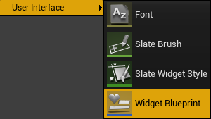

打开WebBrowser，如果上面代码都编译通过了，那么在UI的Palette中应该会有一My栏，栏中有一个My Web Browser控件，这就是我们创建的自定义WebBrowser。

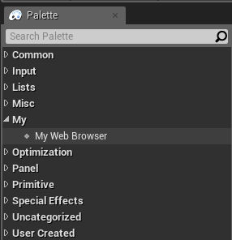

将My Web Browser拖入Hierachy中的Canvas Panel中并调整好大小。

## 2.显示UI

打开关卡蓝图，写入如下蓝图脚本：

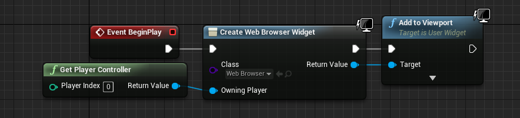

注意，Class中填入的是我们刚创建的UI蓝图webBrowser。

## 3.嵌入Web

在UI蓝图webBrowser的Graph中写入如下蓝图脚本，在New URL中下入www.baidu.com用以测试。

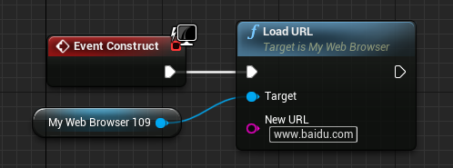

运行测试

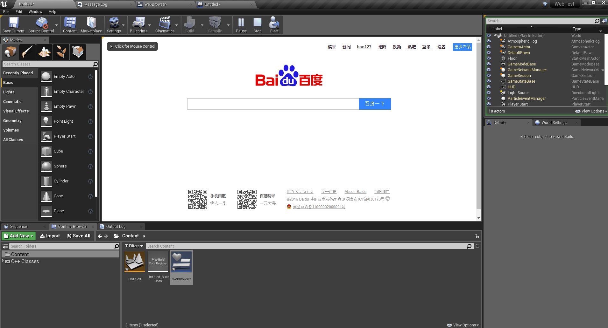

测试通过。

# 三、UE4到Web通信

UE4到Web的通信，这里以UE4到ECharts的通信为例，首先到ECharts官网下载一个自己喜欢的图表源码到本地。

ECharts官网： https://www.echartsjs.com/zh/index.html 

我以折线图为例

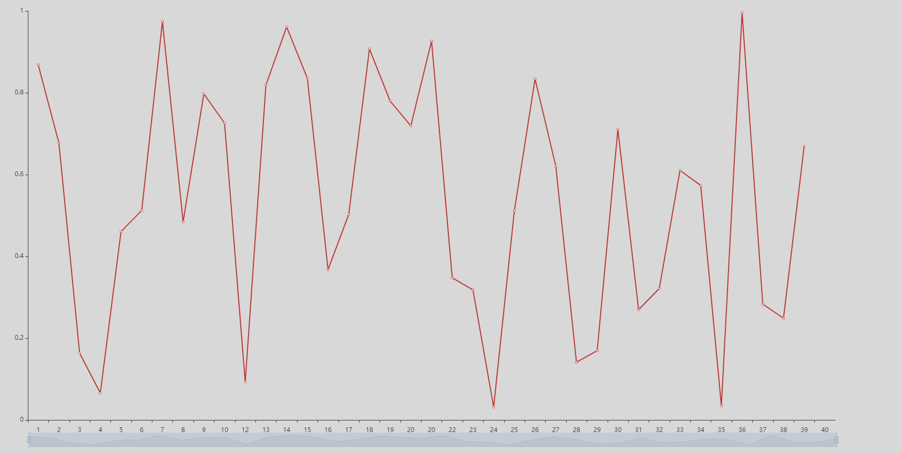

ECharts上手较为简单，官方有5分钟快速上手教程，有详尽的API解释，这里不多累赘。

这里以使用UE4设置折线图Y轴的最大值和最小值为例。

## 1.通信前的准备

UE4到Web的通信需要通过SWebBrowser类的一个函数来绑定通信对象，然后通过这个对象进行数据通信。

首先我们需要定义一个函数

```C++
UFUNCTION(BlueprintCallable, Category = "Web Browser")
void UMyWebBrowser::BindUObject(const FString & Name, UObject * Object, bool bIsPermanent);
```

函数调用SWebBrowser类里的`void SWebBrowser::BindUObject(const FString & Name, UObject * Object, bool bIsPermanent);`函数实现通信中介的创建。

这里要注意BindUObject函数需要暴露给蓝图调用。

函数实现

```C++
void UMyWebBrowser::BindUObject(const FString & Name, UObject * Object, bool bIsPermanent)
{
	if (WebBrowserWidget.IsValid())
	{
		WebBrowserWidget->BindUObject(Name, Object, bIsPermanent);
	}
}
```

## 2.创建通信对象与数据传递方法

然后再在WebBrowser的Graph的蓝图脚本中添加BindUObject的调用创建通信中介对象。

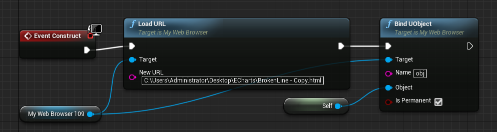

其中Name中填写的就是通信中介对象的名字，名字可以自定义，这里命的名字在Web中调用时用的对象名，中介对象就是Self，即当前Widget对象。

UE4到Web的通信是Web主动调用UE4的方法，通信的数据则是这个方法的返回值，Web可以获取到这个返回值，通过这个对象中的这个方法的返回值即可达到数据通信的目的。

在WebBrowser的My Blueprint/Functions中添加两个用于数据传递的方法，GetMin和GetMax。

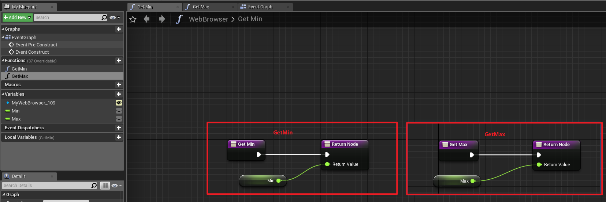

<font color = red>这里要注意，用于数据传递的方法的返回值的名字必须是`ReturnValue`否则数据无法传递。</font>

之后就可以在Web中操作通过obj这个对象操作这些函数来获取UE4里的Min和Max变量了。

这里贴出Web源码：

```javascript
<!DOCTYPE html>
<html>
<head>
    <meta charset="utf-8">
    <!-- 引入 echarts.js -->
	<script src="C:/Users/Administrator/Desktop/ECharts/echarts.min.js"></script>
    <script src="C:/Users/Administrator/Desktop/ECharts/jquery.min.js"></script>
</head>
<body style = "background-color:#d8d8d8">
    <!-- 为ECharts准备一个具备大小（宽高）的Dom -->
	<div id="main" style="width: 1000px;height:450px;position:1px; top:1px;">CHART</div>
	<script type="text/javascript">
         
		var myChart = echarts.init(document.getElementById("main"));
		var x = [1,2,3,4,5,6,7,8,9,10,12,13,14,15,16,17,18,19,20,20,22,23,24,25,26,27,28,29,30,31,32,33,34,35,36,37,38,39,40];
		var y = [];
		
		var y_min = 0;
		var y_max = 1;
		
		function Set(){
			option = {
				tooltip :
				{
					trigger : 'axis',
					//十字锚点
					axisPointer:
					{
						type: 'cross',
						animation: false,
						label: {backgroundColor: '#505765'},
						lineStyle : {type : 'dashed'}
					}
				},
				xAxis: {data: x},
				yAxis: 
				{
					splitLine: {show: false },
					min : y_min,
					max : y_max
				},
				dataZoom: [
					{startValue: '2014-06-01'}, 
					{type: 'inside'}
				],	
				series: {
					type: 'line',
					data: y
				}
			}
		}
		
		function SetYMinAndMax(){
			ue.obj.getmin().then(function(ReturnValue){
				y_min = ReturnValue;
			});
			ue.obj.getmax().then(function(ReturnValue){
				y_max = ReturnValue;
			});
		}
		
		function AddData(){
			y.push(Math.random());
		}
		
		SetYMinAndMax();
		setInterval(function(){
			AddData();
			Set();
			myChart.setOption(option);
		},1000);
    </script>		
</body>
</html>
```

其中SetYMinAndMax函数便是UE4与Web的数据通信。

```javascript
function SetYMinAndMax(){
			ue.obj.getmin().then(function(ReturnValue){
				y_min = ReturnValue;
			});
			ue.obj.getmax().then(function(ReturnValue){
				y_max = ReturnValue;
			});
		}
```

<font color = red>这里还需要注意，ue.obj.getmin()和ue.obj.getmax()必须使用小写，否则也无法通信，其次匿名函数function(ReturnValue)的参数名也必须为ReturnValue不可更改，否则数据依然无法传递。</font>

然后测试一下数据传递是否正确。

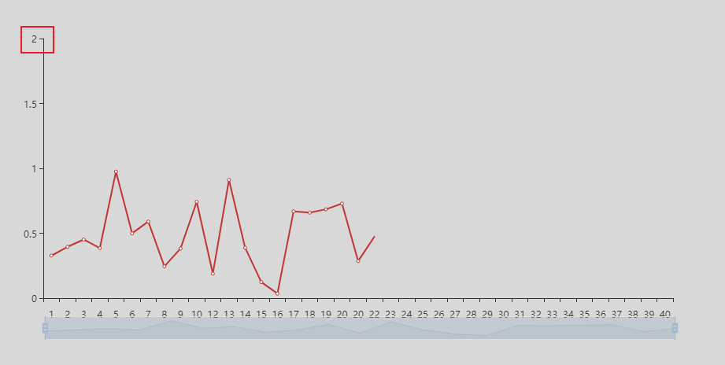

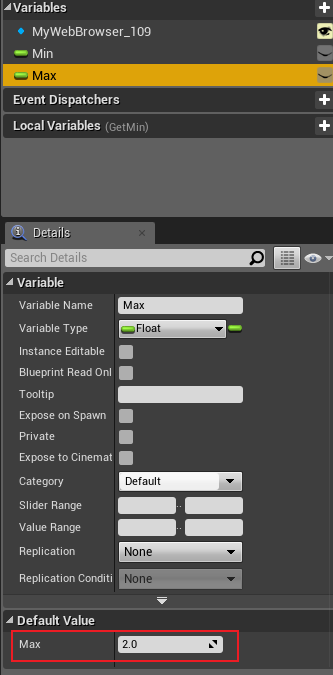

可以看到Y轴的最大值由1改为了Max变量的值2。数据传递成功。

上面的Web程序要运行还需要两个文件`echarts.min.js`和`jquery.min.js`，文件放在：

这是B站上的视频教程：https://www.bilibili.com/video/av47212309