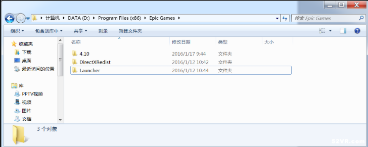
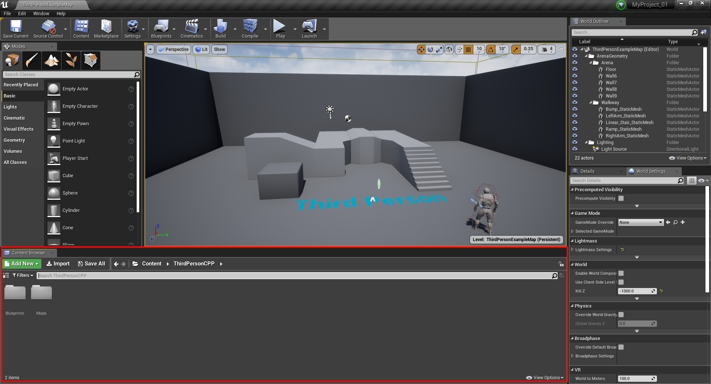
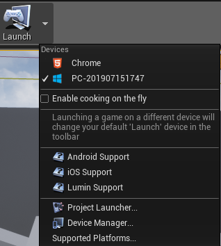
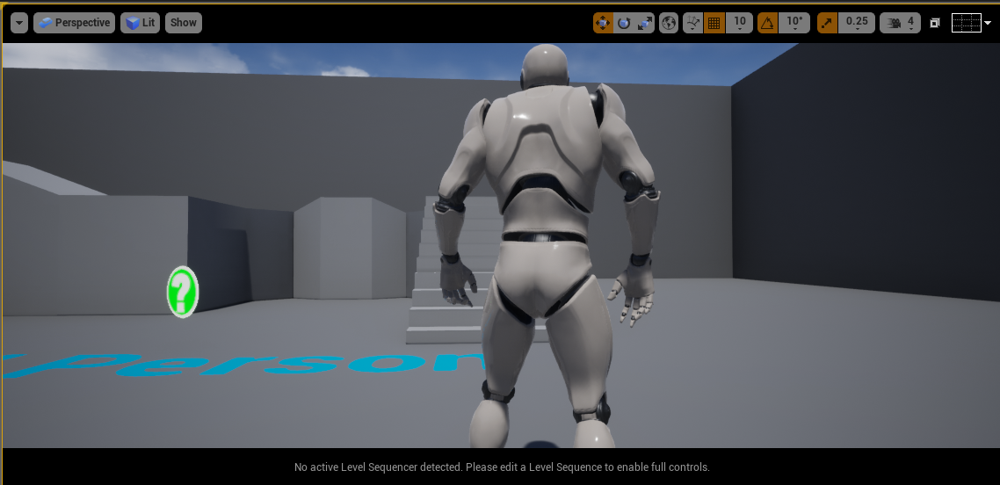
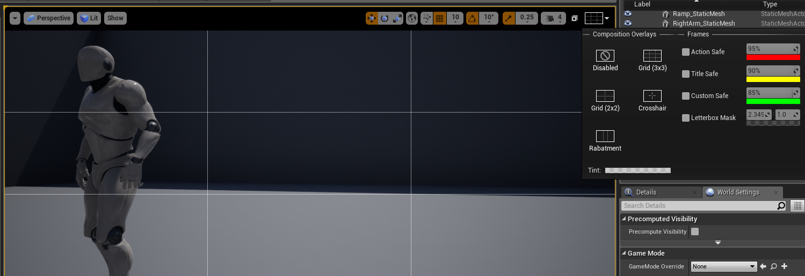
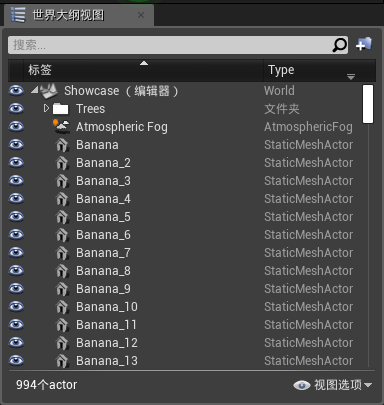
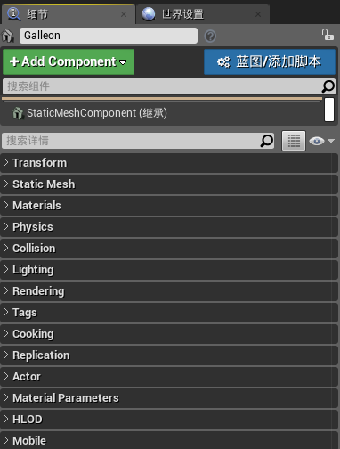

此学习记录在Unity3d的基础之上学习

# 一、UE4目录文件结构

## 1.DirectXRedist

 DirectXRedist是DirectX文件所在的地方。这个文件夹也包括了安装DirectX的安装包。

## 2.Launcher

Launcher是引擎启动器所在文件夹。Launcher包含了如下子文件夹：

- Backup：这里是保存备份的工作。如果中途发生崩溃，或者出现了难以解决的错误，可以从这里恢复工作进度。
- Engine：这个文件夹包括了组成引擎的代码、库和内容。
- PatchStaging：这里保存了下载UE4版本的临时数据。
- VaultCache：这个文件夹包含了所有你从商城购买的资源的缓存。

## 3.4.10

4.10文件夹有如下子文件夹：

- Engine：它包含了所有源代码、库、资源、map文件之类的组成引擎的部分。
- Samples：UE4提供了两个示例Maps，这个文件夹包含了资源，蓝图等。
- Templates：UE4提供了不同类型游戏的模版，这个文件夹包含了不同类型游戏的内容和源代码

不同UE4版本目录结构可能有所不同，但大体上不会有太大差别、

# 二、UE4的工作界面

## 1.开始目录

UE4支持两种工作模式，即蓝图模式和C++编程模式

**蓝图模式**

蓝图模式提供可视化编程，可以做到不写一句代码就可以实现一个完整的游戏，但是蓝图模式对于实现一些复杂的逻辑较为困难。

**C++编程模式**

C++编程模式是较为传统的游戏实现模式，主要以编写代码的方式来实现游戏模块，功能强大，使用灵活。

## 2.菜单栏

**File**

创建、打开、保存关卡/地图和创建或打开项目。游戏打包也是在这里。这里也有不同的设置和建立配置可以修改，后面会详细说明。

**Edit**

撤销、恢复、剪切、复制、粘贴或者重复任何选中的对象（或一组选中的对象）。也可以设置偏好，例如自动保存开关和自动保存的时间、改变快捷键、改变测量单位（厘米、米或千米）。项目设置则提供了描述项目的内容设置、项目ID或项目该如何打包，还有该项目支持什么样的平台。更多的设置读者可以自行探索，直到调整到适合自己工作的方式。

**Window**

编辑器中的窗口布局是完全可以自定义的，这里可以选择增加或删除哪些窗口。你也可以通过鼠标点击窗口标签，然后拖动，再释放鼠标来手动调整窗口位置。注意，有时候窗口的标签默认是隐藏的，这时候点击左上角的黄色箭头，然后标签就会显示出来了。当你打乱了当前的窗口布局，又不知道如何恢复的时候，可以选择窗口菜单中的重置布局。

**Help**

官方教程、文档、论坛、回答中心等常用的超链接都会显示在这里。 

## 3.工具栏

**Save Current**

保存当前的工作进度(当前关卡)，可以防止崩溃造成工作进度大量丢失。

我们一般使用Save All而不使用Save Current

**Source Control**

默认是关闭的，版本管理是协作开发方式，并且它会记录每一次的更改，当你修改了文件，团队中的其他人就会更新修改的文件，并且如果他们修改了文件，你也会被更新文件。通过点击版本控制按钮，选择自己团队的版本控制工具来激活版本管理。

**Content**

包含了所有资源、代码、关卡和其它游戏开发用到的内容。

Content对应Content Browser窗口

Marketplace

一个访问商城的快捷方式。

**Setting**

修改编辑器的设置。例如允许选择半透膜物体、选择组合物体等。引擎的可视化设置，例如分辨率、贴图渲染质量、抗齿锯等都可以在此处设置。

 

**Blueprints**

蓝图是一个UE4的很重要和很常用的特性。这里可以进入蓝图编辑器。

**Cinematices**

你可以使用过场动画来创建电影艺术。

**Build**

当你构建你的关卡，引擎可以预计算灯光和可视化数据、产生导航网络和更新几何体。

**Play**

当你点击播放按钮，在视图中会测试你的关卡和观察是否功能正常。当你点击播放后，会出现暂停、停止、弹出按钮 

- 暂停：当暂停后，你可以点击继续或逐帧播放。
- 停止：停止游戏测试，回到编辑模式。

**Launch**

当你的游戏已经完成并且准备发布，点击启动按钮会制作、打包和生成可执行的应用程序文件（这依赖于选择的平台）。

## 4.视口

 视口位于编辑器窗口中央，这里可以创建和调试你的游戏。将游戏对象都可以放置在这里来创建当前的场景。 

**观察**

按下鼠标左键或右键的同时，你可以使用W、S、A、D来移动到观察的视角。

**选择**

鼠标点击左键。

 在视图上方的是视图工具栏，我们来逐一说明它们：

**视口选项**

这里可以切换到游戏模式，可以将场景像在游戏中那样展示出来，所以那些音量、隐藏的actors和actor图标都会被隐藏起来。还有沉浸模式，将会以全屏模式显示。还有其他设置选项可以被设置，所以最好自己亲自试试。

快捷键：G

**视口投影类型**

这里有两种视口投影类型，一种是正交投影、一种是透视投影。透视投影符合人的视觉，所以看起来更像3D场景，而正交投影像是将某个轴去掉后的2D平面。

**视口渲染模式**

设置显示的渲染模式，默认的是带光照模式，将游戏中的灯光显示在视口中。你可以切换到不带灯光模式，就会没有任何灯光了。线框模式，只会显示模型的线框。 

 **显示**

设置哪些类型的actor可以显示出来，哪些类型被隐藏。

**变换工具**

这里有三种变换方式。第一个是平移，第二个是旋转，第三个是缩放。

使用方法和Unity一致

 **坐标系统**

切换全局坐标系和局部坐标系。如果选中的是全局坐标系，则变换会以世界坐标系的轴为准。如果选中的是局部坐标系，则变换会以物体自身旋转的方向的轴为准。

**表面对齐、表面网格对齐、表面网格对齐值**

接着的这三个工具涉及到平移的对齐操作。表面对齐的时候，只要两个actor的轴心在底部，当它们靠近的时候就会自动对齐了。网格对齐，是每次移动的时候都会移动网格对齐值大小的值。

**旋转网格对齐、旋转网格对齐值**

类似于表面网格对齐，旋转网格对齐每次旋转都是旋转某个固定的旋转网格对齐值。

**缩放网格对齐、缩放网格对齐值**

类是于上面两个对齐，每次缩放的时候都是按某个固定的缩放网格对齐值来缩放。

**摄像机速度**

设置当按下箭头键的时候摄像机移动的速度。

**最大化和恢复视口**

当你点击右上角的这个按钮的时候，最会在透视视图和三视图+透视视图之间切换（见下图），三视图就是正视图、俯视图和左视图。每个视图都有自己的视图工具栏，你在某个视图中右上角点击一下，然后该视图就会被最大化。

 

**网格**

## 5.世界大纲

世界大纲视图有层次地展示了在场景中的所有actor。

在世界大纲视图你可以进行这些操作：
**新建文件夹**：你可以通过文件夹管理使得actor整洁有序，也可以通过文件夹来选中一组actor（右键文件夹，选择-所有子项）。

**隐藏actor**：在actor和文件夹前面有一只眼睛，通过点击它来隐藏/显示该actor或文件夹下的所有actor。
**附加actor**：通过拖动一个actor到另一个actor，可以形成附加关系。如果你移动父关系的actor，所有的子actor都会跟着移动。如果移动子actor，父actor就不会跟着移动。需要注意的是，这只能通过世界大纲视图完成，在视口中移动父actor是不会影响子actor的。 

左下角显示的是有多少个actor，右下角显示的是设置视图过滤方式的选项。

## 6.内容浏览器

所有游戏资源，包括材质、贴图、网格、蓝图、音频文件都会在这里显示出来。这里是导入、组织、观察甚至创建游戏资源的地方。 

在顶部有三个图标，下面逐一介绍它们：

- 添加新项：创建新的资源，例如材质、粒子系统、蓝图等等。
- 导入：导入内容到项目文件中。
- 保存所有：如果在内容浏览器创建或修改资源，点击保存所有来保存这些工作。

然后接着下面有个搜索条，可以输入要搜索的资源名字来快速查找它们。右上角的锁图标可以锁住所有“在内容浏览器查找”的请求。所谓“在内容浏览器查找”就是在视口中右键actor的时候，弹出菜单中选择“在内容浏览器查找”就会将查找到的对应资源显示在内容浏览器中。如果锁住了，则不会在内容浏览器中显示出来，而是打开一个新的窗口显示。

在下方左侧有个源面板，源面板包含了你的项目中收集的所有文件夹。在下方右侧，是资源视图，显示了从源面板中选择的资源和子文件夹。在上方有个过滤器，可以指定你想要查看的资源类型。右方就是资源搜索栏。在底部左方你可以看见当前选择的文件夹有多少个资源，底部右方可以选择视图选项，选择你观察项目的方式，例如是平铺块、列表还是列显示方式 

## 7.细节

 在细节面板，你可以看见和修改当前选择的actor属性。 

在顶部，你可以看到选择的actor的名称（图中是Chair）。你可以设置自己喜欢的命名。在右方，就是一个锁按钮。默认是解锁状态，当锁住的时候，细节面板会锁定当前的属性和细节，如果你选择另一个actor也不会改变。 

下方的搜索栏可以搜索你想查看的属性，接着是属性矩阵按钮，这会打开一个属性矩阵窗口。再右方是显示过滤器，你可以选择折叠/展开所有的种类、只显示修改的属性或显示高级属性。 

在名字的下方，有两个按钮，添加组件和蓝图/添加脚本。添加组件，可以添加例如静态网格、形状基本几何体（正方体、球体、圆柱和圆锥体），灯光actor等。这跟世界大纲视图中的附加Actor类似。接着，你可以转换选择的actor到蓝图类。蓝图类是作为一个组件，伴随着代码（Unity等一些其它引擎中，称为Prefab预制件）。

 最后，下方是属性区域，这里显示选择的actor属性,例如位置、旋转、缩放、当前的材质、添加和移走材质等等你可以修改的内容。 

# 三、UE4的快捷键

| 按键                   | 动作                             |
| :--------------------- | :------------------------------- |
| 鼠标左键               | 选择actor                        |
| 鼠标左键+拖动          | 前后移动和左右旋转摄像头         |
| 鼠标右键               | 选择actor并打开右键菜单          |
| 鼠标右键+拖动          | 旋转摄像头方向                   |
| 鼠标左键+鼠标右键+拖动 | 摄像头上下左右移动               |
| 鼠标中键+拖动          | 摄像头上下左右移动               |
| 滑轮向上               | 摄像机向前移动                   |
| 滑轮向下               | 摄像机向后移动                   |
| F                      | 聚焦选中的actor                  |
| 箭头方向键             | 摄像机前后左右移动               |
| W                      | 选中平移工具                     |
| E                      | 选中旋转工具                     |
| R                      | 选中缩放工具                     |
| W+任何鼠标按键         | 摄像机向前移动                   |
| S+任何鼠标按键         | 摄像机向后移动                   |
| A+任何鼠标按键         | 摄像机向左移动                   |
| D+任何鼠标按键         | 摄像机向右移动                   |
| E+任何鼠标按键         | 摄相机向上移动                   |
| Q+任何鼠标按键         | 摄像机向下移动                   |
| Z+任何鼠标按键         | 增加视野（鼠标释放后会恢复原状） |
| C+任何鼠标按键         | 缩小视野（鼠标释放后会恢复原状） |
| Ctrl+S                 | 保存场景                         |
| Ctrl+N                 | 创建新场景                       |
| Ctrl+O                 | 打开一个已有的场景               |
| Ctrl+Alt+S             | 另存为新场景                     |
| Alt+鼠标左键+拖动      | 复制当前选中的actor              |
| Alt+鼠标右键+拖动      | 摄像机前后移动                   |
| Alt+P                  | 进入Play预览模式                 |
| Esc                    | 退出预览模式                     |
| F11                    | 进入仿真模式                     |

# 四、UE4中的类

## 1.Actor类

Actor类具有组件挂载能力，即所有需要挂载组件的对象都需要继承Actor类，但是有一点是需要纠正的，Actor类不是必须的，说“Actor类是一切实体的基类”这种说法严格意义上来说是不正确的，比如：做一个管理类对象就不需要挂在其他的组件。

还需要注意的一点是，UE4中的component和Unity中的component是极大的区别的，在UE4中一个场景实体对应一个类，而Unity中一个场景实体可以挂载多个脚本组件，一个脚本组件就是一个类。

