# 一、UE4的角色控制框架

做角色控制之前，我们首先要了解UE4的角色控制框架，了解引擎是如何控制角色移动和做出各种骚姿势的。

## 1.Pawn

Pawn类就是UE4里可用于操控的游戏物体，Pawn类继承自Actor拥有Actor的所有特性，并且Pawn还带有

- Controller：可以被操控；
- PhysicsCollision：物理碰撞；
- MovementInput：事件响应，大多数情况下用于键盘输入事件响应。

## 2.Character

Character就是我们即将要使用的类，Character继承自Pawn，也拥有可操控性，物理碰撞和事件响应，除此之外，Character还拥有CapsuleComponent(椭圆碰撞体)，ArrowComponent(角色正面方向)，Mesh。我们向Mesh上添加模型，Character便拥有了可显示的网格。

当然Pawn派生的还有defaultPawn,SpectatorPawn，这里就不探讨了。

## 3.Controller

Controller也派生自Actor，是与Pawn平级的类，Controller负责控制Pawn及Pawn的派生类，但Controller一般负责高层面的控制，如角色切换，多角色控制等，而Pawn和Character负责处理角色自身的简单控制逻辑，如角色的移动，跑，蹲，跳等运动逻辑。

由于Controller是独立Pawn存在的，所以Controller可以独立存在与World中，如：上帝视角。

一个Controller可以控制多个Pawn，一个Pawn也可以被多个Controller控制。

但是一个Pawn要想被控制就必须关联至少一个Controller，否则尽管在Pawn中编写了控制逻辑，我们依然无法操控Pawn。

# 二、角色控制

与U3D的角色控制一样，在UE4中进行角色控制前也需要进行按键的映射注册。

## 1.注册按键映射

在`Project Settings/Input/Bindings`下，有一个Action Mappings(行为映射)和一个Axis Mappings(轴映射)，Action Mappings是与角色三维坐标轴无关的映射，一般用于触发角色的行为，如：跳，蹲，拾取等行为，并且UE4还为Action Mappings封装好了组合键，在U3D中，组合键的逻辑是需要我们自己写的。Axis Mappings是与角色三维坐标轴有关的映射，一般用于触发角色的移动与视角控制。

 我们将映射注册好之后，UE4会自动按照我们的命名创建触发事件蓝图，这个在后面详细讲解。

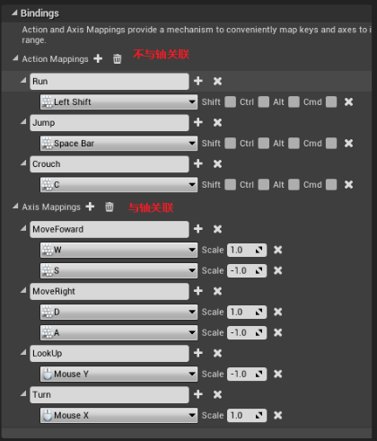

这里详细说一下视角控制，视角控制一般使用鼠标来控制(当然也可以使用键盘，只是大多数情况下使用鼠标)，所有我们使用的映射是Mouse Y和Mouse X，我们用一张图来理解Mouse Y和Mouse X的方向：

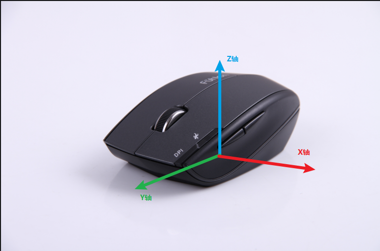

Mouse Y就是鼠标的Y轴，Mouse X就是鼠标的X轴。

## 2.使用角色蓝图编写控制逻辑

首先我们创建一个继承自Character的蓝图类，然后为Character中添加SpringArm组件并在SpringArm组件下添加Camera组件，SpringArm组件是专门为Camera服务的组件，用于连接Mesh和Camera，可以对Camera进行一些操作，如相机偏移等。

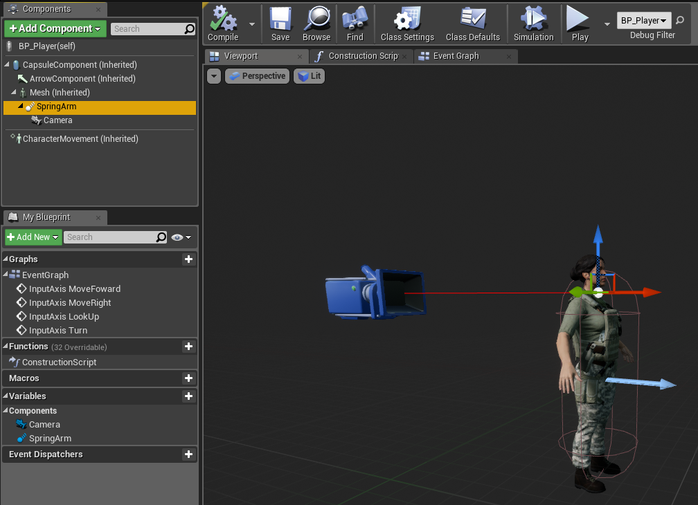

然后向Mesh中添加我们需要的模型，一个Character基本组件就搭建好了

然后我们就可以在Character蓝图类的Event Graph中编写控制逻辑了。

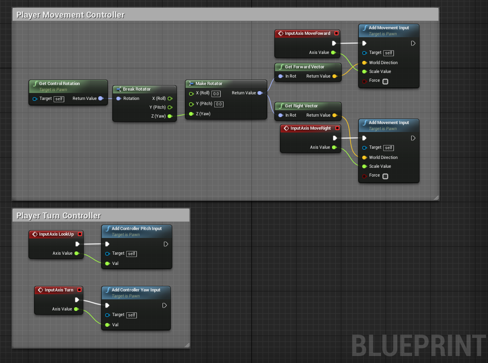

Input Axis MoveForword，Input Axis MoveRight，Input Axis LookUp，Input Axis Turn都是UE4按照我们注册按键映射时的名字为我们创建好的事件，当我们按下对应的键时事件就会被触发。

UE4使用MovementComponent封装好了Pawn的移动实现，Character中也自带有一个CharacterMovement，我们只需要向组件中添加输入就可以使角色移动了，Add Movement Input函数就是用于MovementComponent组件输入的函数，我们只需要传给Add Movement Input函数移动方向和值就可以使角色按照我们规定的方向移动，移动方向的获取，UE4也封装好了Get Forward Vector(正前方)和Get Right Vector(正右方)来获取某一个轴上的正前与正右的方向矢量，Get Control Rotation函数可以获取角色当前的方向矢量，而角色的前后左右移动是在Z轴的垂直面，即XY平面上移动，所以我们需要获取Z轴的正前正右的方向矢量，我们可以使用Break将角色当前的方向矢量拆开成xyz三个标量，只拿Z轴的值再使用Make封装成矢量，这样Get Forward Vector和Get Right Vector所拿到就是Z轴的正前方与正右方了。

而角色的视角转向，UE4使用的是 Controller Yaw，Controller Pitch，Controller Roll来控制的，Controller Yaw控制的是角色的上下方向的视角旋转，Controller Pitch控制的是角色的左右方向的视角旋转，Controller Roll控制的是角色的前后方向的视角旋转，和MoveComponent一样UE4也提供Add Controller Yaw Input，Add Controller Pitch Input，Add Controller Roll Input分别为三者传值。我们只需要将映射对应的值输入给三个函数即可实现角色视角的旋转控制了，然后勾选SpringArm的Details/Camera Settings/Use Pawn Controller Rotation，将视角旋转控制应用到相机上，这样角色就可以通过鼠标进行视角控制了。

## 3.关联角色控制器

UE4的角色控制框架规定了，我们必须为角色关联一个Controller才可以对角色进行控制。

在角色的Details/Input/Auto Receive Input选项中可以切换控制器，UE4为我们封装好了一个Controller--Player 0，我们选择Player 0就可以对角色进行控制了。其他的Palyer 1，Player 2等是用于其他的用途的，我们这里不探讨。

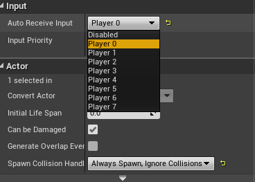

#  三、配置骨骼动画

完成以上步骤，我们的角色就可以在场景中自由自动了，但是这个移动只是纯移动，并不带有移动动画，要想移动更真实，我们还需要为角色配置骨骼动画。

需要注意的是不是什么动画都可以往角色身上套的，只有和角色骨骼相匹配的动画才可以被角色使用，如果我们想要使用某些动画，我们就需要设置模型的骨骼为这些动画配套的骨骼。

## 1.配置骨骼

在导入模型的时候就可以为模型选定骨骼，选定好骨骼的模型导入工程后就不能在更换骨骼了，想要更换骨骼就需要重新导入。这里我们使用UE4自带的骨骼。

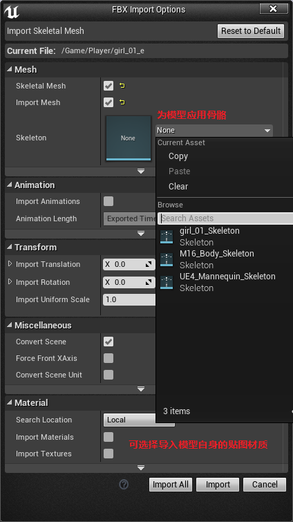

还有一步是为模型添加物理资产，在模型视图的Asset Details/Physics/Physics Asset选择与骨骼动画配套的物理资产，至于这个物理资产具体是干什么的这里不深究。

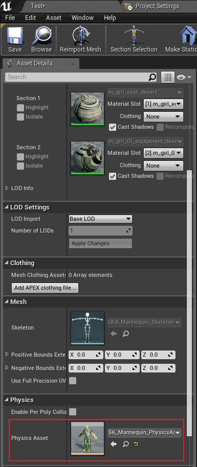

## 2.混合空间

如上图，我们可以看到一个Blend Space和一个Bland Space 1D，这是UE4专门用来处理某一类动画混合的模块。Blend Space是二维混合空间，可以混合两个方向上的动作，比如，向前前后是一个方向，向左向右是一个方向，Blend Space就可以混合这两个方向的所有动作；而Blend Space 1D则只能混合一个方向上的动作。

这里我们需要为角色前后左右两个方向上的移动添加动作，所以选择Blend Space。打开混合空间

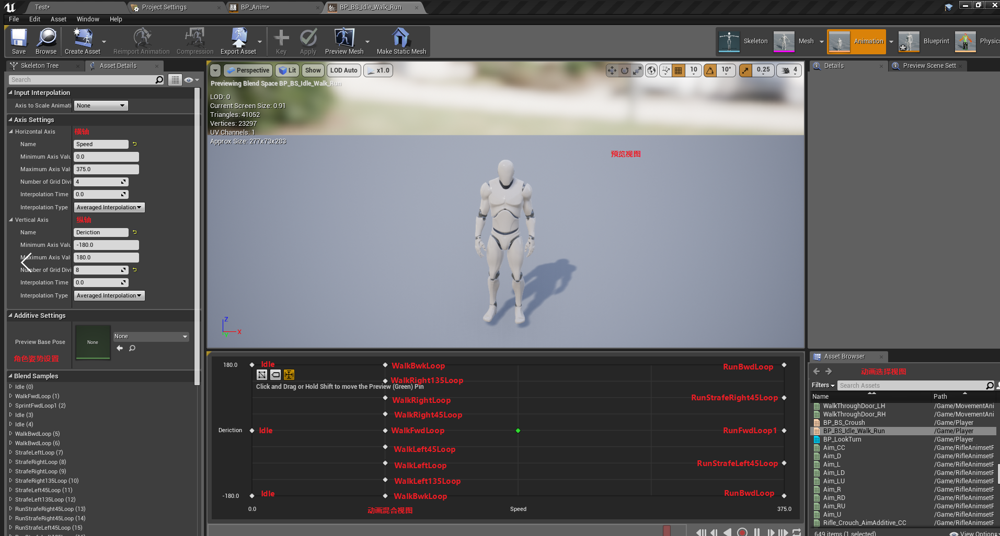

在动作混合视图中UE4已经为我们预设好了很多骨骼动画，横轴与纵轴的名字要命名规范，因为这两个轴的名字会作为混合空间的参数，从外界传值进来的。横轴纵轴的最大值最小值和分割数都可以根据自己的实际需求设置。

Preview Base Pose是用来设置关键帧姿势的，有的骨骼动画直接包含了姿势动作，Preview Base Pose会自动赋值，有的骨骼动画只包含了动作，这时就需要我们手动赋予姿势了，如我们后面需要用到的扭头的动画。

然后添加上我们需要的动画即可，当Speed变化时，角色的动画会在Idle-Walk-Run之间切换，当Deriction变化时，角色的动画会在Left和Right之间切换。

## 3.动画蓝图

Animation Blueprint是UE4封装的专门用于管理动画的类，Animation Blueprint可以管理骨骼动画的混合空间也可以直接管理骨骼动画。

在Content Browser中右键选择Animation/Animation Blueprint，然后Parent Class选择父类为AnimInstance，Target Skeletion选择我们角色应用的骨骼，就可以创建一个管理我们选定的骨骼动画的管理蓝图了。

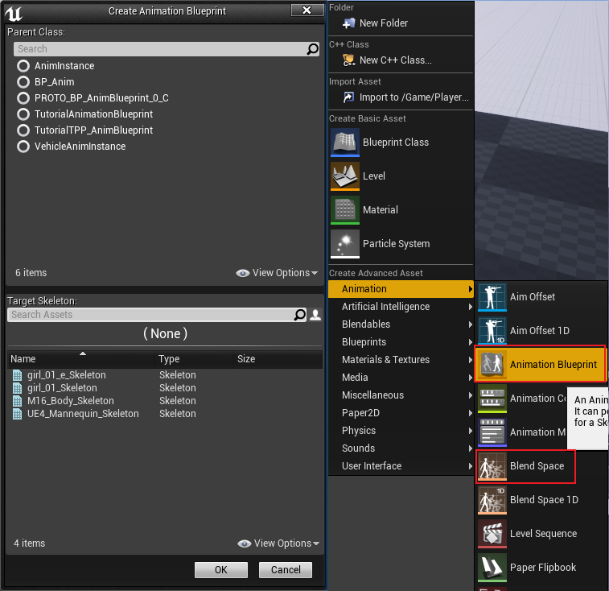

进入动画蓝图，在Anim  Graph视图，我们可以看见一个Final Animation Pose节点，这是UE4封装好的处理角色最终要显示的动画的模块，右键添加添加一个状态机。

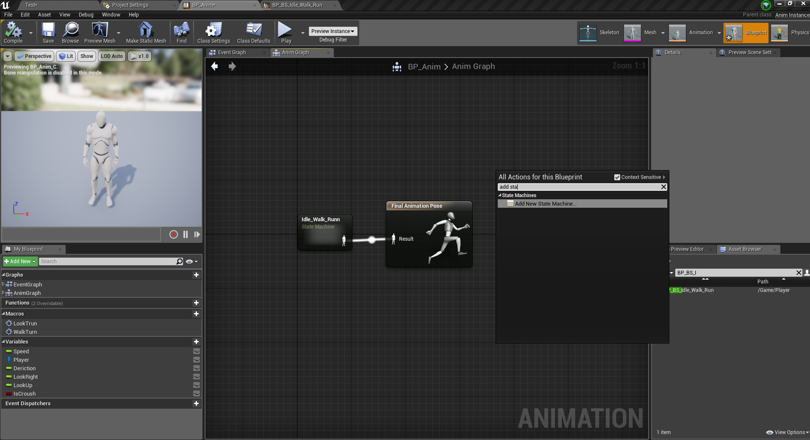

双击状态机，进入状态机里，右键添加一个状态并命名为Idle_Walk_Run。一个状态机可以管理多个状态。

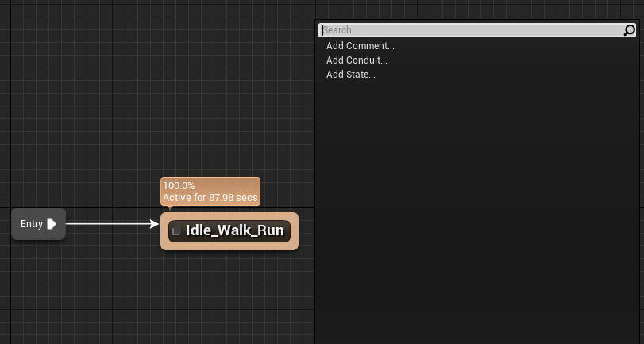

双击进入状态，在右侧Asset Browser中选择我们配置好的混合空间，并在左侧MyBlueprint/Variables中添加两个变量Speed和Deriction分别给混合空间的横轴Speed和纵轴Deriction赋值。

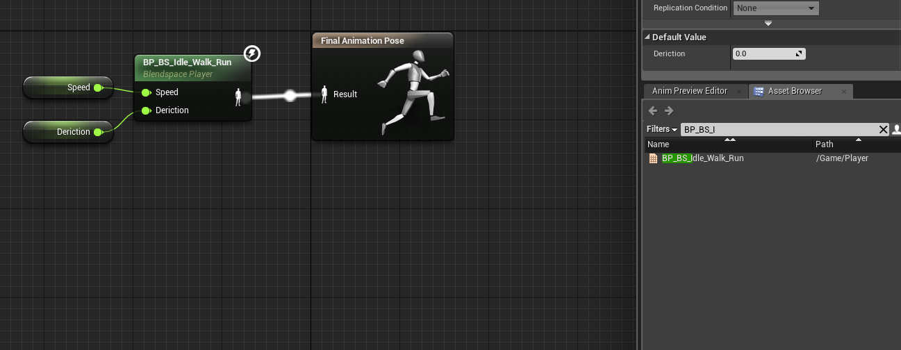

然后在动画蓝图的Event Graph中编写逻辑为Speed和Deriction变量赋值。

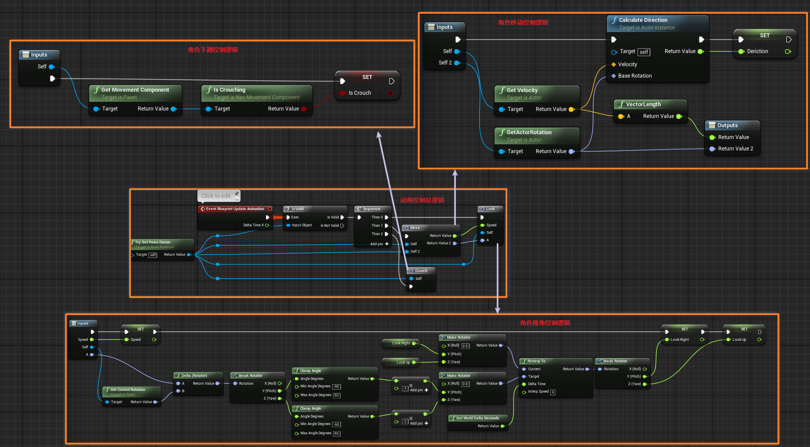

直接看到角色移动的控制逻辑，UE4为我们封装好了Caculate Deriction来计算角色的移动方向，我们只需要使用Get Velocity和GetActorRotation获取角色的速度矢量和旋转方向赋值给Calculate Deriction既可以了，速度矢量的模，UE4也封装好了VectorLength来计算。

最后在角色蓝图的Mesh的Details/Animation中将Animation Mode设置成Use Animation Blueprint，将Anim Class设置成我们创建的动画蓝图，这样我们的动画就可以应用到我们的角色上了。

# 四、多动画管理

我们的游戏角色一般不可能只有移动的动画，一般还会有其他的动画，如拾取，下蹲等，这时我们就需要进行多动画混合空间的管理了。

多动画管理有两类，一类是与角色移动动画同级的混合动画，在一个时刻是能播放一个动画，二者不兼容，如下蹲，一类是可以在角色移动动画播放的同时也可以播放的混合动画，在一个时刻两个动画都可以播放，二者兼容，如角色站立时扭头。

## 1.不兼容的同级动画管理

按照第三步，我们也可以创建一个Blend Space来混合下蹲动画。当然如果下蹲动画只有一个，就没必要使用Blend Space了，可以直接使用动画蓝图来管理动画。

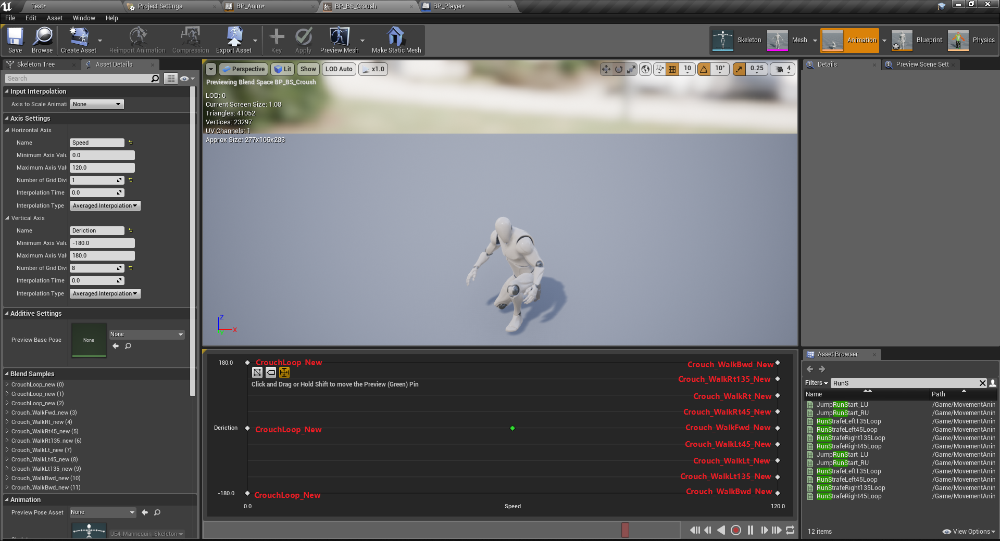

同样，我们创建一个状态机Crouch，在状态机里配置下蹲动画。

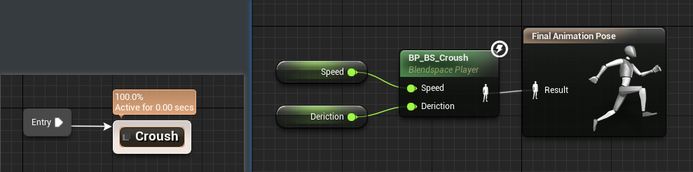

需要注意的是，下蹲动画的横轴和纵轴也需要命名为Speed和Deriction，因为我们的下蹲移动使用的也是前后左右两个方向来控制动画。

然后在动画蓝图的Anim Graph中添加一个Blend Poses by bool来管理移动与下蹲动画，并创建一个bool值来判断动画的执行

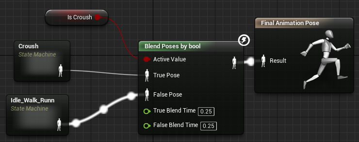

Is Crouch为true时走True Pose,为False时走False Pose，并且可以设置两个分支的动画过度时间。

然后就是在Event Graph中编写下蹲动画的控制逻辑。如步骤三中逻辑控制图的下蹲控制逻辑，UE4甚至封装好了下蹲判断，Is Crouching，可以直接判断角色当前是否处于下蹲状态，直接将这个状态赋值给IsCrouch变量，然后使用Get MoveMen Component给Is Crouching传值。

当然如果我们有更多的不兼容动画需要管理，UE4也为我们提供了Blend Poses by int来管理

## 2.可兼容动画管理

可兼容的动画的混合就不是使用Blend Space来混合了，而是使用Aim Offset来混合。

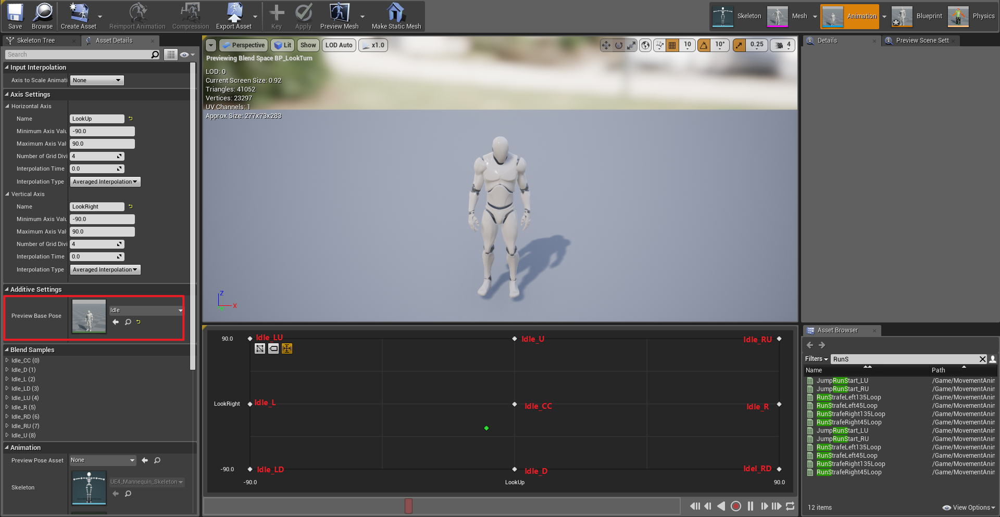

一般可兼容的动画使用的是关键帧，即只有动画没有姿势，我们需要将动画应用到某一姿势上去，如上图应用到Idle上的Idle的扭头动作。

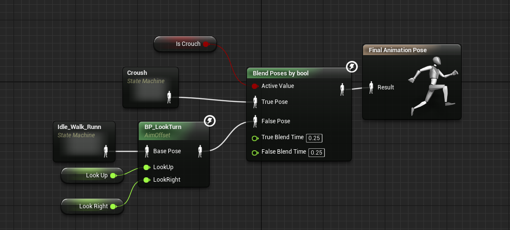

