# 一、蓝图可视化脚本与蓝图系统

## 1.蓝图脚本

蓝图可视化脚本简称“蓝图”或“蓝图脚本”，是一种需要编译的面向对象的可视化编程语言，蓝图完全集成在UE4中，蓝图通过节点与连线工作。

### 蓝图脚本的节点

- 触发事件，在蓝图脚本中以红色的节点出现
- 函数，在看图脚本中以蓝色的节点出现
- 变量，在蓝图脚本中中以黄色节点出现

## 2.蓝图系统

蓝图系统又称“蓝图”或“蓝图类”，蓝图类可以看成是一个包含游戏内容的容器，其中可以包含组件、脚本或可以仅仅包含数据。

蓝图类有点类似Unity3d中的预设(prefb)，蓝图类可以类似预设一般保存对象状态，可以随时拖入场景中使用，只是在其他功能上不如预设，如预设在U3D中的打包中可以发挥出优秀的效果，但是蓝图类只能作为容器使用。

 蓝图类包含蓝图脚本，每一个蓝图类都包含一个默认的蓝图脚本。

### 蓝图类的分类

- **关卡蓝图**：关卡蓝图在每个Level中只能存在一个，负责整个关卡的运行逻辑，关卡的初始化，帧更新都在关卡蓝图里进行；
- **普通蓝图**：普通蓝图就是UE4的预设，在普通蓝图中我们可以对其中的对象进行一些的配置，如设置网格，贴图，粒子特效，添加相机，添加物理材质和挂载蓝图脚本等等；
- **游戏模式蓝图**：UE4中游戏模式也是以蓝图的形式存在的，游戏模式蓝图控制一系列游戏的规则；
- **材质蓝图**：在UE4中贴图材质也是蓝图的形式存在的，在材质蓝图中我们可以如同建模软件一般对材质进行一系列更高级的材质配置，如下图的一个简单示例：

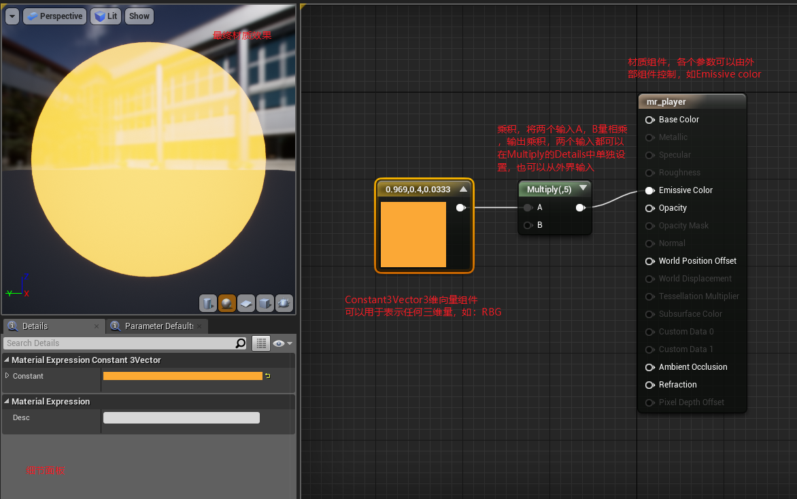

## 4.创建蓝图

创建蓝图的方法很多，这里介绍比较常用的方法

- 可以直接在Content Browser(内容浏览器)中右键创建一个空的蓝图类，空蓝图除了包含一个根组件外不再包含其他东西，当我们在空蓝图中创建了对象后可以通过拖拽的方式将对象拖动到根组件位置处，用游戏对象替换根组件作为根组件，这样创建空蓝图时的白色小球就会消失；
- 在World Outliner(世界大纲)中选中游戏对象，可以通过工具栏中的Blueprints工具中的下面两个选项创建一个包含所选内容的蓝图类；

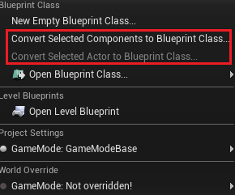

- 通过Blueprints工具的New Empty Blueprint Class也可以直接创建空蓝图类；
- 然而关卡蓝图似乎只能通过Blueprints工具的Open Blueprint Class打开。

# 二、变量与对象引用

## 1.在蓝图中创建变量

在蓝图中创建变量的方式有两种，其一：直接点击My BluePrint/Variables/+Variable，默认创建bool行的变量，可以点击变量前的色块更换变量类型。

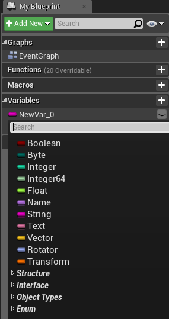

其二：在蓝图脚本区域右键->输入Get New Var，可以直接在蓝图脚本中以节点的形式创建变量，在右侧细节面板中设置变量的值。

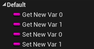

所有创建好的变量都会在My Blueprint面板Variables栏中显示。

## 2.在蓝图中使用变量

可以直接在蓝图脚本区域右键->输入Get/Set [变量名]即可获取变量的获取/设置组件，也可以直接从左侧的My Blueprint面板Variables栏中拖拽变量到蓝图脚本区域选择Get/Set。

## 3.在蓝图中使用组件引用

很多时候我们需要调节自身Actor上的组件的某些参数，那么我们就需要获得这个组件的引用以便获取组件上的参数进行调节，那么我们如何获得组件的引用呢？

其实方法也很简单，在My Blueprint/Variabales下有一个子栏“Components”其中存放着当前Actor上的所有的组件的引用，使用方法就是直接将需要的组件引用拖拽到蓝图脚本区域即可。获得了组件引用我们就可以通过引用使用不同的方法获取组件上的不同的参数了。

## 4.动态获取世界大纲中的Actor

在蓝图脚本中有四个方法获取外部Actor：

- Get All Actor of Class：通过类型来获取外部Actor

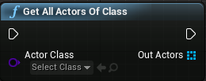

- Get All Actor with Tag：通过标签来获取外部Actor

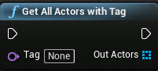

- Get All Actor with Interface：通过外部接口在获取外部Actor

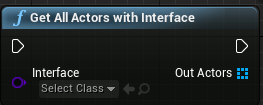

- Get Actors：通过层来获取Actor

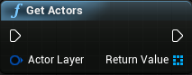

# 三、条件语句

## 1.Branch(if条件判断)

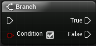

传入一个bool值，进行分流，通常和比较组件配合使用，如：“==”、“>”等。

## 2.Switch

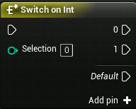

- Selection：case判断的变量；
- Default：默认执行分支；
- Add pin：添加执行分支。

# 四、循环语句

## 1.For Loop(for循环)

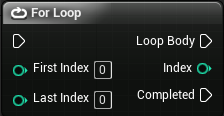

- First Index/Last Index：提供循环的次数；
- Loop Body：循环体执行分支；
- Index：返回当前循环索引；
- Conpleted：循环完毕后执行分支。

## 2.For Loop whit Break(可跳出的for循环)

使用方法和For Loop类似。

## 3.For Each Loop(数组遍历)

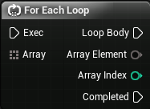

专门有用遍历数组的循环。

- Array：需要遍历的数组；
- Loop Body：循环体分支；
- Array Element：遍历的数组元素；
- Array Index：当前索引；
- Completed：遍历结束执行分支。

## 4.For Each Loop with Break(可跳出的数组遍历)

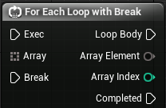

用法和Foreach Loop一样，只是多了一个跳出执行分支。

## 5.Reverse for Each Loop(反向数组遍历)

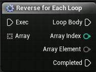

# 四、角色控制

## 1.为角色添加跟随相机

相对U3D来说，UE4的相机跟随要简单得多，UE4中直接将相机设置成了蓝图类的组件，当蓝图类时Player时，即可实现相机对Player的跟随了。

相机跟随需要通过一个物理组件`Spring Arm`来链接相机和Player，将相机附着在Spring Arm下，即可在Spring Arm的作用下实现相机跟随。

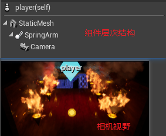

## 2.为角色添加控制器

在UE4的游戏制作过程中，我们不难发现当我们运行游戏时，在世界大纲中多出了很多东西，如下图：

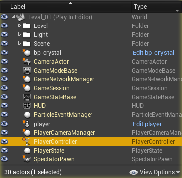

其实，UE4为我们提供很多已经预制好的必须品，如上图的PlayerController(角色控制器)、PlayerCameraMenager(角色相机管理器)等。也就是说不可以直接使用UE4预制给我们的角色控制器来控制我们的Player，而不需要自己再去为Player蓝图配置角色控制器了，我们只需将Player的细节面板上的Auto Possess Player设置成Player0即可，Player0即表示本地角色。

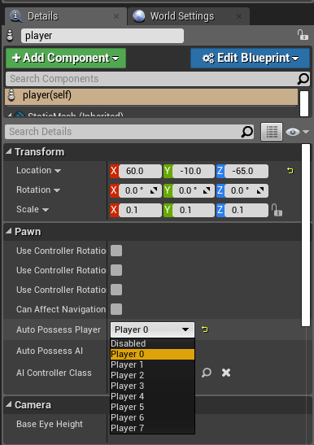

需要注意的是，对于角色控制更优的方式是使用`Player Start`组件去持有Player蓝图类，再通过Player Controller来控制Player Start达到控制角色的目的。

## 3.自定义游戏模式

在我们创建一个UE4工程后，UE4会启用UE4默认的游戏模式`GameModeBase`，GameModeBase就控制着Player Controller、PlayerCameraMenager、PlayerState等运行时UE4动态生成的一些游戏物体，我们可以通过启用我们自定义的游戏模式来设置这些游戏物体按自己的定义的规则来生成运行。

游戏模式也是一个蓝图类，创建游戏模式就是创建蓝图类，只是这个蓝图类需要继承自GameModeBase类，继承自GameModeBase类的蓝图就是一个游戏模式蓝图。不过在我们第一此=次打开游戏模式蓝图时，UE4会将游戏模式蓝图识别成一个普通蓝图，而进入普通蓝图的编辑模式，可能是bug吧，此时我们只需将蓝图关闭，再打开一次，UE4便可以识别出游戏模式蓝图了。

游戏模式蓝图中可以定义自己的游戏模式规则，比如我们可以通过修改Spectator Class选项为自定义的游戏物体，这样在游戏运行时，UE4将不再生成DefaulPawn，而是会生成我们指定的游戏物体。

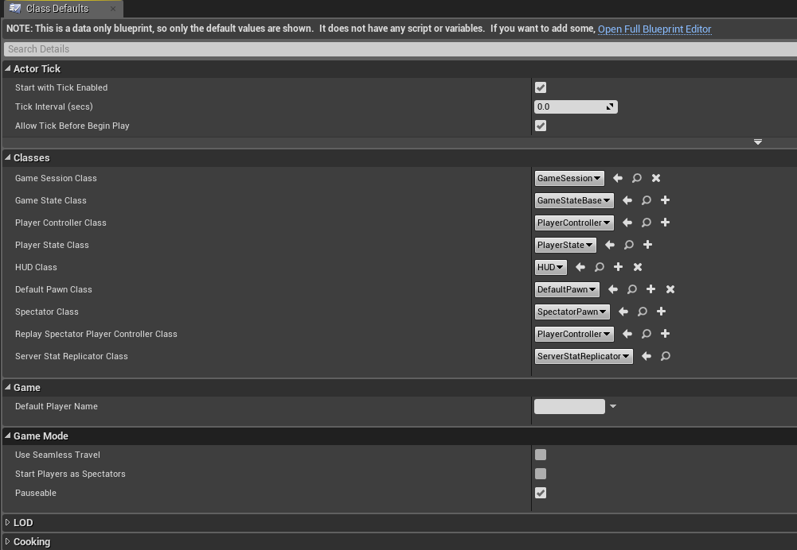

配置好游戏模式后我们还需要让当前项目使用我们自定义的游戏模式，通过Seettings ->Project Settings->Project/Maps&Modes->Dfault GameModes，选择我们自己的配置的游戏模式即可让当前项目启用我们自己定义的游戏模式了

## 4.操控角色控制器

我们要操控角色控制器就需要配置键盘按键映射，配置好的键盘映射会以函数的形式加入蓝图脚本组件集中。

我们在Seettings ->Project Settings->Engine/Input->Bindings/Axis Mappings设置键盘映射并可以配置映射的值，

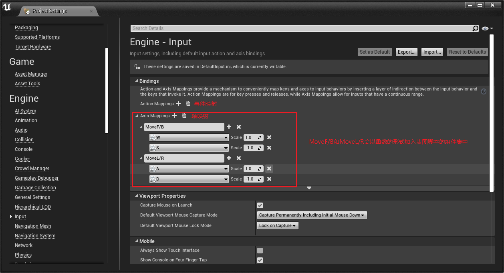

配置好键盘映射以后便可以在蓝图脚本中使用这些函数主键来控制我们Player了，控制角色运动的方法很多，我这里以旋转力矩的方式来控制小球运动，具体的控制方法如下：

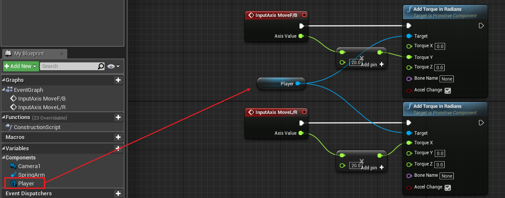

加入两个键盘映射函数组件(InputAxis MoveF/B,InputAxis MoveL/R)、两个添加角度力矩的组件(Add Torque in Radians,Add Torque in Radians)，但是添加角度力矩组件是需要一个控制目标的，我们需要从左侧的My Blueprint面板的Components中将需要控制的物体Player拖入脚本蓝图中，分别连接到添加角度力矩组件的Target上。

这里还需要注意的一点是，在我们为Player添加相机时，相机使用的是相对于Player的局部坐标，使用局部坐标的相机会跟随Player旋转，而使用世界坐标的相机将会固定某一个角度跟随Player移动。切换方法为：下拉Spring Arm的细节面板/Transform/Rotation的三角箭头选择切换。

并且相机默认情况下是启用了物理碰撞的，但大多数情况下我们是不需要让相机出现物理碰撞的，所以我们也应当取消相机的物理碰撞。操作方法为：取消Spring Arm的细节面板/Camera Collision/Do Collision Test选项。

当然要想比较真实的模拟出物理效果，光这样是不行的，因为默认情况下Player是没有启动物理模拟的，我们需要启用Player的细节面板/Physics/Simulate Physics选项，并且将调节Player的细节面板/Linear Damping(线性摩檫)和Player的细节面板/Angular Damping(旋转摩檫)到适当的值，应为UE4默认是没有旋转摩檫的并且，默认线性摩檫为0.01。

##  小知识

-  大多数时候我们都需要勾选作用力函数组件的Acel Change选项，如：上面的Add Torque in Radians，勾选了Acel Change选项作用力组件会在作用目标物体时忽略物体的质量因素，因为存在质量影响的话，我们可能需要给一个极大的力才能推动目标物体；
-  有时可能默认大小的作用力对目标物体的移动作用达不到我们理想的效果，此时可以先将作用力加倍后在传递给作用力组件，蓝图脚本组件集中提供多种多样的乘积组件，我们上面使用的是float*float组件；

# 五、触发器

在游戏设计中触发器的使用是非常平凡的，而在蓝图中触发器的实现也并不复杂，我们来看一下具体操作：

## 1.创建触发器

- 蓝图模式中游戏的一切都是蓝图，触发器也不例外，所以要做一个触发器，首先我们的创建一个蓝图的壳子，并继承自Actor类
- 触发器还需要一个极为重要的东西就是碰撞体，当然这里的碰撞体不是具有物理碰撞的网格碰撞体，而是蓝图的物理组件集中的Box Collison，一个没有物理碰撞效果专门用于触发器的盒碰撞体，我们给蓝图类添加这个组件，一个触发器便完成了

## 2.使用触发器

当触发器放置于场景中，有物体进入触发器碰撞盒时，触发器便会出自动发触发Event ActorBeginOverlap时间组件，之后我们便可以进行一系列逻辑操作了。