不同的蓝图脚本拥有不同的组件集，蓝图脚本的组件集过于庞大，这里只对自己使用过的组件进行列举。

说明：红色字体表示一级目录组件，绿色字体表示二级目录，黄色字体为三级目录(三级目录较为少见所以使用和二级目录相同的三级标题)，白色字体为具体组件说明。

# 一、材质蓝图组件

## Constans(常量)

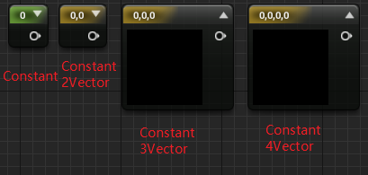

| 组件            | 作用                                              |
| --------------- | ------------------------------------------------- |
| Constans        | 一维量，可以表示任何一维数据，如：小数、整数等    |
| Constans2Vector | 二维量，可以表示任何二维数据，如：二维坐标        |
| Constans3Vector | 三维量，可以表示任何三维数据，如：三维坐标、RBG等 |
| Constans4Vector | 四维量，可以表示任何四维数据，如：四元数          |

## Math(数学函数)

#### **Multiply(乘积)**

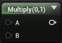

### Lerp(插值)

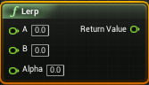

Lerp组件在Math的多个二级目录中存在，有各种类型的插值变化。

**输入：**

- A：插值变化的起始值；
- B：插值变化的目标值；
- Alpha：插值的变化规则，连接Float的TimeLine插值将按照TimeLine的规则变化。

**输出：**

- Return Value：返回变化后的插值，将Lerp放入帧函数中可以获得每帧变化的插值。

# 二、普通蓝图组件

------

## Add Event(添加事件)

### Collision(碰撞体组件)

#### **Event ActorBeginOverlap(自动触发触发器)**

每当有物体进入触发器时自动触发

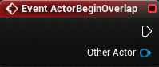

- Other Actor：返回进入触发器的游戏物体的信息。

## Event BeginPlay

游戏开始时自动触发

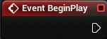

## 

## Add TimeLine(添加时间线)

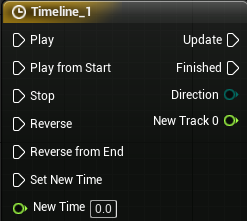

**输入：**

- Play：播放，播放完毕下一次触发时不会从头开始，而是会从上一次时间点继续开始；
- Play from Start：从头开始播放，每次触发都从时间线起点开始执行；
- Stop：暂停，触发后直接从当前时刻暂停；
- Reverse：倒序播放，从当前时刻开始倒叙播放；
- Reverse from End：从末尾开始倒序播放；
- Set New Time：设置新的时间起点，即时间线从新设置的时间点开始执行；
- New Time：新的时间起点由外部输入。

**输出：**

- Update：在时间线内每帧执行；
- Finished：时间线结束时触发；
- Direction：返回时间线的执行方向，只有两个值“Forward”和“Backward”；
- New Track 0：自己创建的时间线，创建了才会有，显示的名字也是自己命名的时间线的名字。

## Camera Fades(相机渐变)

Camera Fades组件是只有在Get Player Camera Menager组件的外拉中才能搜索到的专门服务于Get Player Camera Menager组件的相机组件集。

#### **Start Camera Fade(开始渐变)**

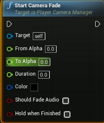

- Target：渐变目标相机，默认为当前相机；
- From Alpha：渐变起始Alpha；
- To Alpha：渐变目标Alpha；
- Duration：渐变持续时间；
- Color：渐变颜色；
- Should Fade Audio：启用声音渐变；
- Hold when Finished：渐变结束后保持当前Alpha值。

#### **Stop Camera Fade(结束渐变)**

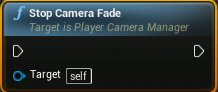

触发时立刻停止当前渐变。

## Input(输入流)

### Keyboard Events(按键触发事件)

包含所有键盘按键出发事件

## Game

#### **Get Player Pawn(获取角色对象)**

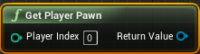

- Play Index：输入角色索引，可以直接设置也可以外部输入；

- Return Value：返回获取的角色对象(Object)。

#### **Get Current Level Name(获取关卡名字)**

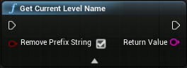

- Remove Prefix String：移除前缀字符串；
- Return Value：返回获取到的关卡名称(String)。

#### **Get Player Camera Manager(获取角色相机管理器)**

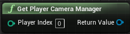

- Player Index：输入角色索引；
- Return Value：返回输入角色身上的相机对象。

## Rendering(渲染)

### Components

###  Light

#### **Set Intensity(设置光源强度)**

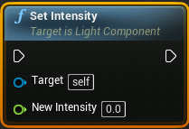

- Target：目标光源；
- New Intensity：目标光源强度。

#### **Get Intensity(获取光源强度)**

使用和Set Intensity一样。

## Utilities(通用组件)

### Flow Control

#### **Branch**(if语句)

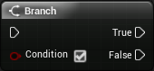

蓝图的if语句

- Condition：输入的判断条件，一般和各种判断组件的输出连接。

#### **Delay(延迟函数)**

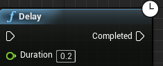

- Duration：延迟时间。

### Keyboard Events(按键触发事件)

包含一些字符串操作函数。

### Text

#### **Equal**

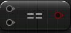

输入两个比较对象，输出判断结果(Bool)。

各种其他的判断组件用法一致。

###  Transformation

#### **Set Actor Scale 3D**

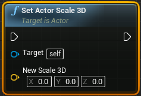

设置Actor的Scale值

- Target：要设置的目标Actor；
- New Scale 3D：要设置的目标Scale值。

#### **Get Actor Scale 3D**

获取Actor的Scale值。

# 二、物理组件

UE4除了提供大量蓝图脚本函数组件来对蓝图类进行精细控制外还提供了一系列物理组件对蓝图类进行一些常规的复杂控制。

## Camera

#### **Camera**

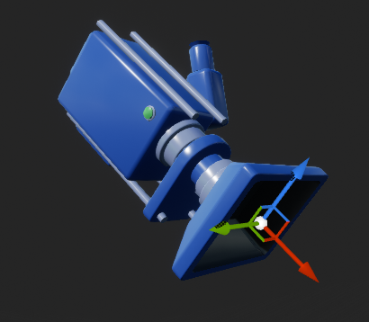

相机，用于渲染视野，一般配合Spring Arm一起使用。

#### **Spring Arm**

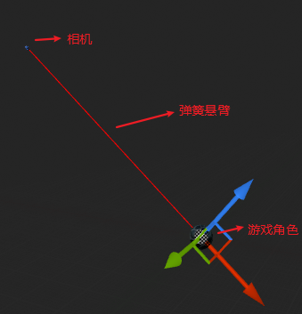

弹簧悬臂，将相机附于其上可以实现相机跟随

## Movement

#### **Rotating Movement**

旋转控制，提供一系列参数对对蓝图类的旋转运动进行控制

## Rendering

#### **Static Mesh**

静态网格，网格控制蓝图的贴图材质、模型外观、阴影渲染等

